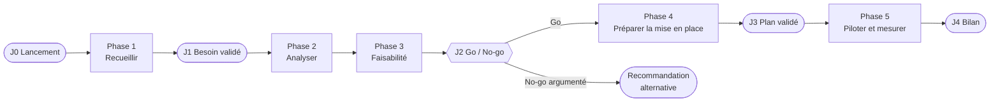

# La méthode CPMS — du besoin exprimé à la mise en place

> **Concevoir · Piloter · Mesurer · Sécuriser**
> Une organisation vous dit ce qu'elle veut. Votre travail n'est pas de coder ce qu'elle dit :
> c'est de comprendre ce dont elle a besoin, de dire si c'est faisable, et d'organiser une mise en place qui tienne.

---

## 1. Les quatre verbes

| Verbe | La question qu'il pose | Ce qu'on produit |
|---|---|---|
| **Concevoir** | *De quoi ont-ils vraiment besoin, et quelle solution y répond ?* | Recueil, besoins reformulés, étude de faisabilité, solution retenue |
| **Piloter** | *Comment passe-t-on de la décision à un service utilisé ?* | Plan de projet, risques, journal de bord, plan de déploiement |
| **Mesurer** | *Comment saura-t-on que ça a marché ?* | Situation de départ chiffrée, indicateurs cibles, recette, bilan |
| **Sécuriser** | *Qu'est-ce qui peut mal tourner pour les données et les personnes ?* | Inventaire des données, besoins DICP, conformité RGPD, plan de sécurisation |

Les quatre verbes **ne se font pas l'un après l'autre**. On mesure dès le premier entretien (combien de temps ça prend aujourd'hui ?) et on sécurise dès qu'on voit passer une donnée personnelle. C'est pour cela que la méthode est découpée en **phases**, et que chaque phase produit des artefacts des quatre couleurs.

## 2. Les cinq phases et leurs jalons

| Phase | Concevoir | Piloter | Mesurer | Sécuriser | Jalon de sortie |
|---|---|---|---|---|---|
| **1. Recueillir** | C1 Parties prenantes · C2 Guide d'entretien · C3 Comptes rendus | P3 Journal de bord *(ouvert dès J0)* | M1 §1 Situation de départ | S1 §1 Inventaire des données | **J1 — Besoin validé** : le client signe la reformulation |
| **2. Analyser** | C4 Fiche besoins | | M1 §2 Indicateurs cibles | S1 §2 Besoins DICP | — |
| **3. Faisabilité** | C5 Étude de faisabilité et scénarios | P2 Registre des risques *(ouverture)* | | S2 Fiche RGPD | **J2 — Go / No-go** : 10 min de présentation devant le client |
| **4. Préparer la mise en place** | C6 Dossier de solution | P1 Plan de projet · P4 Plan de déploiement | M2 Cahier de recette | S3 Plan de sécurisation | **J3 — Plan validé** |
| **5. Piloter et mesurer** | *(preuve de concept, optionnelle)* | P3 Journal de bord *(clôture)* | M3 Bilan | S3 *(vérification des mesures)* | **J4 — Bilan** |

**Un « No-go » n'est pas un échec.** Conclure, preuves à l'appui, qu'il ne faut rien développer et qu'un outil existant ou une réorganisation suffit est une réponse professionnelle. Ce qui est sanctionné, c'est un « Go » sans argument, ou un « No-go » par paresse.

## 3. Les 16 artefacts

Tous les modèles sont dans [`modeles/`](modeles/). Copiez-les dans `livrables/` (voir [`livrables/README.md`](livrables/README.md)) et remplacez chaque marqueur `⟪ … ⟫` par votre contenu (les `⟪À COMPLÉTER⟫` signalent les rubriques principales, les `⟪ex. …⟫` donnent un exemple).

### Concevoir

| Code | Artefact | Ce qu'il doit prouver |
|---|---|---|
| C1 | [Carte des parties prenantes](modeles/C1-parties-prenantes.md) | Vous savez **qui** exprime le besoin, qui décide, qui paie, qui subira le changement — et ce ne sont pas les mêmes personnes |
| C2 | [Guide d'entretien](modeles/C2-guide-entretien.md) | Vous arrivez à l'entretien avec des questions ouvertes, pas avec une solution |
| C3 | [Compte rendu d'entretien](modeles/C3-compte-rendu-entretien.md) | Vous séparez ce qui a été **dit** (verbatim), ce que vous en **comprenez**, et ce qui reste **à vérifier** |
| C4 | [Fiche besoins](modeles/C4-fiche-besoins.md) | Le besoin est reformulé en problèmes, puis en récits utilisateur avec critères d'acceptation, priorisés (MoSCoW) |
| C5 | [Étude de faisabilité](modeles/C5-etude-faisabilite.md) | Au moins **trois scénarios** comparés sur la grille TELOS, dont un « sans développement » ; une recommandation Go / No-go |
| C6 | [Dossier de solution](modeles/C6-dossier-solution.md) | La solution retenue est décrite (maquette, architecture, coûts) et chaque choix structurant est justifié |

### Piloter

| Code | Artefact | Ce qu'il doit prouver |
|---|---|---|
| P1 | [Plan de projet](modeles/P1-plan-projet.md) | Lots, jalons, charges, RACI : on sait qui fait quoi, quand, et combien ça coûte |
| P2 | [Registre des risques projet](modeles/P2-registre-risques.md) | Les risques sont identifiés, cotés et ont une parade et un responsable |
| P3 | [Journal de bord](modeles/P3-journal-de-bord.md) | L'équipe trace ses décisions, sa météo et ses écarts à chaque séance |
| P4 | [Plan de déploiement et d'accompagnement](modeles/P4-plan-deploiement.md) | La mise en service est pensée pour les utilisateurs réels : formation, communication, reprise des données, retour arrière |

### Mesurer

| Code | Artefact | Ce qu'il doit prouver |
|---|---|---|
| M1 | [Situation de départ et indicateurs](modeles/M1-indicateurs.md) | On a chiffré **l'avant** et fixé des cibles mesurables pour **l'après** |
| M2 | [Cahier de recette](modeles/M2-cahier-recette.md) | Chaque exigence « Must » a au moins un test d'acceptation que le client peut exécuter |
| M3 | [Bilan](modeles/M3-bilan.md) | Écart entre prévu et obtenu, sur le produit **et** sur le projet ; ce que l'équipe referait autrement |

### Sécuriser

| Code | Artefact | Ce qu'il doit prouver |
|---|---|---|
| S1 | [Données et besoins DICP](modeles/S1-donnees-dicp.md) | Chaque donnée manipulée est inventoriée et cotée en Disponibilité, Intégrité, Confidentialité, Preuve |
| S2 | [Fiche RGPD](modeles/S2-fiche-rgpd.md) | Le traitement est décrit comme dans un registre CNIL ; la nécessité d'une AIPD est tranchée |
| S3 | [Plan de sécurisation](modeles/S3-plan-securisation.md) | Menaces réalistes → mesures concrètes ; sauvegarde, droits, continuité et réversibilité |

## 4. Les règles du jeu

1. **Le client, c'est l'enseignant.** Il joue les interlocuteurs de l'organisation. Il ne répond qu'aux questions posées : ce que vous ne demandez pas, vous ne le saurez pas.
2. **Le besoin exprimé n'est pas le besoin.** Le document `besoin-exprime.md` de chaque cas contient volontairement des solutions déguisées en besoins, des contradictions et des oublis.
3. **Tout ce qui est affirmé est sourcé.** « Le client veut X » → quel entretien, quelle phrase ? « Cette solution coûte Y » → quel site, quelle date de consultation ?
4. **Chaque artefact vit dans le dépôt.** Un artefact qui n'est pas commité n'existe pas. Un commit par artefact au minimum, avec un message qui dit ce qui a changé.
5. **Le suivi se fait dans GitHub.** Un ticket (*issue*) par récit utilisateur et par risque ouvert ; un tableau *Projects* pour la vue d'ensemble ; les jalons GitHub (*milestones*) portent les noms J1 à J4.
6. **L'IA est un outil, pas un auteur.** Vous pouvez l'utiliser pour préparer un guide d'entretien, reformuler ou comparer. Vous indiquez en bas de l'artefact ce qu'elle a produit et ce que vous avez vérifié. Un compte rendu d'entretien inventé est une faute.

## 5. Quelques repères

| Sigle | Signification | Où on l'utilise |
|---|---|---|
| **MoSCoW** | *Must, Should, Could, Won't (this time)* — priorisation des exigences | C4 |
| **TELOS** | Faisabilité **T**echnique, **É**conomique, **L**égale, **O**pérationnelle, calendaire (***S**chedule*) | C5 |
| **RACI** | *Responsible, Accountable, Consulted, Informed* — qui fait quoi | P1 |
| **DICP** | **D**isponibilité, **I**ntégrité, **C**onfidentialité, **P**reuve — besoins de sécurité d'une donnée | S1 |
| **AIPD** | Analyse d'impact relative à la protection des données (*DPIA* en anglais) | S2 |
| **SMART** | Indicateur **S**pécifique, **M**esurable, **A**tteignable, **R**éaliste, **T**emporellement défini | M1 |
| **Gherkin** | `Étant donné… Quand… Alors…` — écriture d'un critère d'acceptation testable | C4, M2 |
| **ADR** | *Architecture Decision Record* — une décision, son contexte, les options, la conséquence | C6 |

Ressources à connaître : le [modèle de registre des traitements de la CNIL](https://www.cnil.fr/fr/RGDP-le-registre-des-activites-de-traitement), la [liste CNIL des traitements soumis à AIPD](https://www.cnil.fr/fr/liste-traitements-aipd-requise), le [guide d'hygiène informatique de l'ANSSI](https://messervices.cyber.gouv.fr/guides/guide-dhygiene-informatique).
