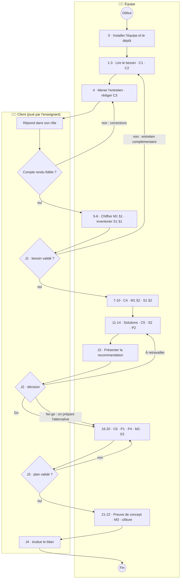
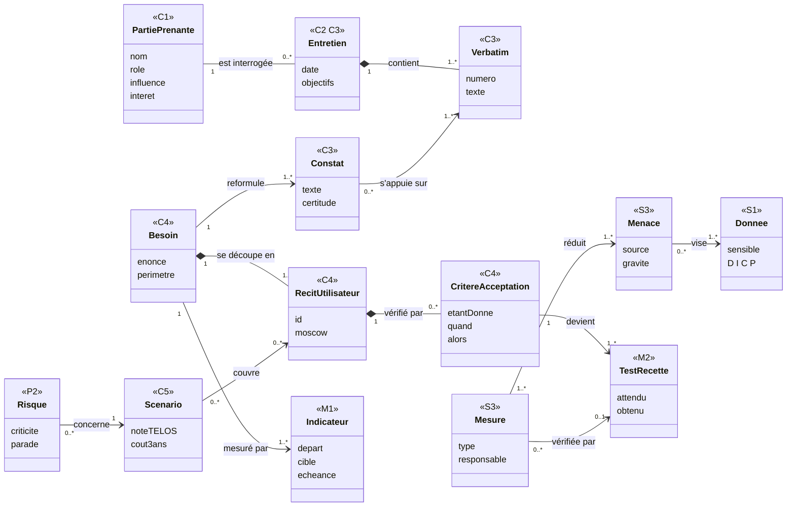
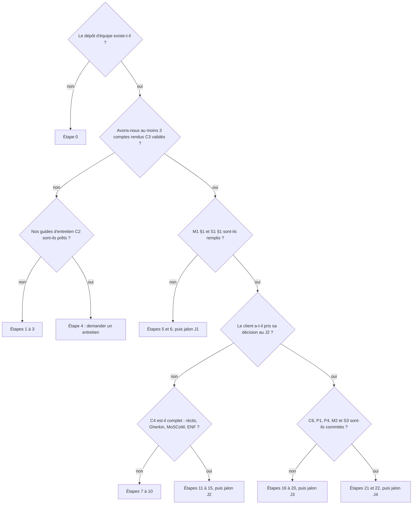

# La méthode CPMS, pas à pas

> **Concevoir · Piloter · Mesurer · Sécuriser**
>
> Une organisation vous dit ce qu'elle veut. Votre travail n'est pas de faire ce qu'elle dit : c'est de comprendre ce dont elle a **besoin**, de dire si c'est **faisable**, et d'organiser une **mise en place** qui tienne.

**Première séance ?** Commencez par [DEMARRER.md](DEMARRER.md), puis revenez ici.

---

## 1. La méthode en une minute

Vous allez suivre **22 étapes**, regroupées en **5 phases**, séparées par **4 jalons** où l'enseignant (dans le rôle du client) valide votre travail. Chaque étape produit ou complète un **artefact** — un document Markdown rangé dans `livrables/`.

Chaque artefact appartient à l'un des **quatre verbes** :

| Verbe | La question qu'il pose | Artefacts |
|---|---|---|
| 🟦 **Concevoir** | *De quoi ont-ils vraiment besoin, et quelle solution y répond ?* | C1 à C6 |
| 🟧 **Piloter** | *Comment passe-t-on de la décision à un service réellement utilisé ?* | P1 à P4 |
| 🟩 **Mesurer** | *Comment saura-t-on que ça a marché ?* | M1 à M3 |
| 🟥 **Sécuriser** | *Qu'est-ce qui peut mal tourner pour les données et les personnes ?* | S1 à S3 |

Les quatre verbes **se mélangent** dans le temps : on mesure dès le premier entretien (combien de temps ça prend aujourd'hui ?) et on sécurise dès qu'on voit passer une donnée personnelle.

**Pour chaque étape, vous avez trois aides :**

| | Où | À quoi ça sert |
|---|---|---|
| 📖 **Fiche méthode** | [`guide/`](guide/) | pourquoi l'étape, ce dont vous avez besoin, comment faire pas à pas, pièges, « j'ai fini quand… » |
| 📄 **Modèle** | [`modeles/`](modeles/) | le document à copier dans `livrables/` et à compléter (remplacez chaque `⟪ … ⟫`) |
| 🧩 **Exemple rédigé** | [`exemples/hbc-val-de-furan/`](exemples/hbc-val-de-furan/) | le même artefact rempli pour un petit club de handball fictif, avec des encadrés « 💡 Pourquoi ? » |

**La routine d'une étape :** lire la fiche 📖 → regarder l'exemple 🧩 → copier le modèle 📄 → le remplir avec **les documents de votre cas** et **vos entretiens** → cocher les critères de qualité en bas du modèle → commiter → fermer le ticket.

**Le déroulement complet, en diagramme d'activité UML** (couloir de gauche : votre équipe ; couloir de droite : le client) :

Chaque rectangle est une activité de l'équipe, chaque losange une décision du client. Les flèches qui remontent montrent qu'on **revient en arrière** quand le client n'est pas d'accord : c'est normal, c'est prévu.

**Pour comprendre les processus en schémas :**

| | Contenu |
|---|---|
| 🗺️ [Diagrammes UML de la méthode](guide/schemas-uml.md) | activité (ci-dessus), séquences (entretien, jalon, recette), états (vie d'un artefact, d'un récit, d'un risque), classes (comment les artefacts s'enchaînent) |
| 🌳 [Arbres de décision](guide/arbres-de-decision.md) | 13 arbres pour les choix difficiles : classer une phrase, MoSCoW, SMART, donnée sensible, base légale, AIPD, IA ou pas, quel scénario recommander, quelle bascule… |
| ✏️ [Aide-mémoire UML en Mermaid](guide/aide-memoire-uml-mermaid.md) | pour dessiner **vos** diagrammes : processus actuel et cas d'utilisation (C4), processus cible et séquence (C6) |

Les fiches méthode contiennent, dans leur section **🗺️ En schéma**, le diagramme ou l'arbre utile à l'étape.

---

## 2. Le parcours

Dans les tableaux, **« Documents du cas »** désigne les fichiers du dossier `cas/<votre cas>/`. Le tableau [§3](#3-quels-documents-de-mon-cas-pour-quelle-étape-) indique précisément lesquels, cas par cas.

### Phase 1 — Recueillir *(séances 1 à 3)*

**But :** comprendre la situation **avant** de penser à une solution.

| Étape | Ce que vous faites | Verbe | 📖 Fiche | 📄 Modèle → livrable | 🧩 Exemple | Vous vous appuyez sur | ⏱ |
|---|---|---|---|---|---|---|---|
| **0** | Former l'équipe, créer le dépôt, les jalons, les tickets ; ouvrir le journal | 🟧 | [E00](guide/E00-installer-equipe-et-depot.md) | [P3 Journal de bord](modeles/P3-journal-de-bord.md) | [P3](exemples/hbc-val-de-furan/P3-journal-de-bord.md) | ce dépôt | 1 h |
| **1** | Lire le besoin exprimé : séparer problèmes, solutions imaginées, contraintes | 🟦 | [E01](guide/E01-lire-le-besoin-exprime.md) | *(notes d'équipe)* | [mini-cas](exemples/hbc-val-de-furan/README.md) | `README.md`, `besoin-exprime.md`, documents texte du cas | 45 min |
| **2** | Lister les parties prenantes et choisir qui interroger | 🟦 | [E02](guide/E02-parties-prenantes.md) | [C1 Parties prenantes](modeles/C1-parties-prenantes.md) | [C1](exemples/hbc-val-de-furan/C1-parties-prenantes.md) | README du cas (interlocuteurs), notes de l'étape 1 | 45 min |
| **3** | Préparer chaque entretien (questions ouvertes) | 🟦 | [E03](guide/E03-preparer-entretien.md) | [C2 Guide d'entretien](modeles/C2-guide-entretien.md) ×3 | [C2](exemples/hbc-val-de-furan/C2-guide-entretien-coach.md) | C1 §4, questions de l'étape 1 | 30 min / guide |
| **4** | Mener l'entretien (12 min, avec l'enseignant) et rédiger le compte rendu ; le faire valider | 🟦 | [E04](guide/E04-mener-entretien-compte-rendu.md) | [C3 Compte rendu](modeles/C3-compte-rendu-entretien.md) ×3 | [C3](exemples/hbc-val-de-furan/C3-compte-rendu-coach.md) | C2 | 1 h / entretien |
| **5** | Chiffrer la situation actuelle à partir des fichiers et des entretiens | 🟩 | [E05](guide/E05-chiffrer-situation-depart.md) | [M1](modeles/M1-indicateurs.md) §1 | [M1](exemples/hbc-val-de-furan/M1-indicateurs.md) | **fichiers CSV du cas**, C3 §3 | 1 h 30 |
| **6** | Inventorier toutes les données manipulées | 🟥 | [E06](guide/E06-donnees-et-dicp.md) | [S1](modeles/S1-donnees-dicp.md) §1 et §3 | [S1](exemples/hbc-val-de-furan/S1-donnees-dicp.md) | C3 §4, colonnes des CSV, formulaires du cas | 30 min |

> 🏁 **Jalon J1 — Besoin validé.** Dans `livrables/` : P3, C1, **au moins 3** C2 et 3 C3 **validés par le client**, M1 §1, S1 §1.
> Vérifier : `python3 outils/verifier.py --jalon J1`

### Phase 2 — Analyser *(séances 3 et 4)*

**But :** transformer ce que vous avez entendu en un besoin clair, découpé, priorisé et mesurable.

| Étape | Ce que vous faites | Verbe | 📖 Fiche | 📄 Modèle → livrable | 🧩 Exemple | Vous vous appuyez sur | ⏱ |
|---|---|---|---|---|---|---|---|
| **7** | Écrire le problème réel derrière chaque demande ; l'énoncé du besoin en une phrase ; le périmètre | 🟦 | [E07](guide/E07-reformuler-le-besoin.md) | [C4 Fiche besoins](modeles/C4-fiche-besoins.md) §1-3 + processus actuel (activité UML) | [C4](exemples/hbc-val-de-furan/C4-fiche-besoins.md) | tous les C3, M1 §1 | 1 h |
| **8** | Écrire les récits utilisateur, leurs critères Gherkin, les prioriser (MoSCoW), chiffrer les exigences non fonctionnelles | 🟦 | [E08](guide/E08-recits-gherkin-moscow.md) | [C4](modeles/C4-fiche-besoins.md) §4-6 + cas d'utilisation UML + un ticket par récit | [C4](exemples/hbc-val-de-furan/C4-fiche-besoins.md) | C4 §1-3, C3 | 1 h 30 |
| **9** | Fixer les indicateurs cibles (usage et effet) | 🟩 | [E09](guide/E09-indicateurs.md) | [M1](modeles/M1-indicateurs.md) §2-3 | [M1](exemples/hbc-val-de-furan/M1-indicateurs.md) | M1 §1, C4 | 45 min |
| **10** | Coter les besoins de sécurité de chaque donnée (DICP) | 🟥 | [E06](guide/E06-donnees-et-dicp.md#étape-10--cotation-dicp-2) | [S1](modeles/S1-donnees-dicp.md) §2 | [S1](exemples/hbc-val-de-furan/S1-donnees-dicp.md) | S1 §1, C3 | 45 min |

### Phase 3 — Faisabilité *(séances 4 et 5)*

**But :** comparer honnêtement plusieurs réponses possibles et recommander la meilleure — y compris « ne rien développer ».

| Étape | Ce que vous faites | Verbe | 📖 Fiche | 📄 Modèle → livrable | 🧩 Exemple | Vous vous appuyez sur | ⏱ |
|---|---|---|---|---|---|---|---|
| **11** | Fixer vos critères, puis chercher ce qui existe déjà (chez le client, dans le secteur, outils génériques) | 🟦 | [E11](guide/E11-rechercher-solutions.md) | `livrables/annexes/comparatif-solutions.md` | [comparatif](exemples/hbc-val-de-furan/annexes/comparatif-applications.md) | C4 (Must, ENF), S1, indices des C3 | 1 h 30 |
| **12** | Comparer 3 scénarios (dont un sans développement) sur la grille TELOS, coûts sur 3 ans, recommander | 🟦 | [E12](guide/E12-faisabilite-telos-couts.md) | [C5 Étude de faisabilité](modeles/C5-etude-faisabilite.md) | [C5](exemples/hbc-val-de-furan/C5-etude-faisabilite.md) | comparatif, C4, M1, S1 | 2 h |
| **13** | Décrire le traitement de données comme dans un registre CNIL ; minimiser ; trancher l'AIPD | 🟥 | [E13](guide/E13-rgpd.md) | [S2 Fiche RGPD](modeles/S2-fiche-rgpd.md) | [S2](exemples/hbc-val-de-furan/S2-fiche-rgpd.md) | S1, C4, C5 | 1 h 30 |
| **14** | Ouvrir le registre des risques du projet | 🟧 | [E14](guide/E14-risques-projet.md) | [P2 Registre des risques](modeles/P2-registre-risques.md) | [P2](exemples/hbc-val-de-furan/P2-registre-risques.md) | C5 §4, C1 (craintes) | 45 min |
| **15** | Présenter la recommandation au client, obtenir sa décision | 🟦🟧 | [E15](guide/E15-presenter-go-no-go.md) | oral + C5 §6 | [P3, séance 5](exemples/hbc-val-de-furan/P3-journal-de-bord.md) | C4, C5, M1, S2, P2 | 1 h 30 + 15 min |

> 🏁 **Jalon J2 — Go / No-go.** Dans `livrables/` : C4, C5, M1 complet, S1 complet, S2, P2 ; **oral de 10 min** devant le client.
> Vérifier : `python3 outils/verifier.py --jalon J2`
>
> **Un « No-go » n'est pas un échec.** Conclure, preuves à l'appui, qu'il ne faut rien développer et qu'un outil existant ou une réorganisation suffit est une réponse professionnelle. Si le client décide « No-go », les phases 4 et 5 portent sur **l'alternative** que vous recommandez.

### Phase 4 — Préparer la mise en place *(séances 5 et 6)*

**But :** rendre la décision exécutable : ce qu'on met en place, qui fait quoi, quand, comment on vérifie, comment on protège.

| Étape | Ce que vous faites | Verbe | 📖 Fiche | 📄 Modèle → livrable | 🧩 Exemple | Vous vous appuyez sur | ⏱ |
|---|---|---|---|---|---|---|---|
| **16** | Décrire la solution : écrans, architecture, processus cible et séquence UML, décisions (ADR), reprise des données | 🟦 | [E16](guide/E16-dossier-solution.md) | [C6 Dossier de solution](modeles/C6-dossier-solution.md) | [C6](exemples/hbc-val-de-furan/C6-dossier-solution.md) | C5 (décision), C4, S1, S2 | 2 h |
| **17** | Découper en lots, planifier, répartir (RACI), budgéter | 🟧 | [E17](guide/E17-plan-projet-raci.md) | [P1 Plan de projet](modeles/P1-plan-projet.md) | [P1](exemples/hbc-val-de-furan/P1-plan-projet.md) | C6, C5, P2 | 1 h 30 |
| **18** | Organiser la bascule et l'accompagnement des utilisateurs | 🟧 | [E18](guide/E18-deploiement.md) | [P4 Plan de déploiement](modeles/P4-plan-deploiement.md) | [P4](exemples/hbc-val-de-furan/P4-plan-deploiement.md) | C1, C6, P1, P2 | 1 h |
| **19** | Écrire les tests que le client exécutera | 🟩 | [E19](guide/E19-recette.md) | [M2 Cahier de recette](modeles/M2-cahier-recette.md) | [M2](exemples/hbc-val-de-furan/M2-cahier-recette.md) | C4 (Gherkin, ENF), S3 | 1 h 30 |
| **20** | Lister les menaces réalistes et les mesures ; sauvegarde, continuité, réversibilité | 🟥 | [E20](guide/E20-securisation.md) | [S3 Plan de sécurisation](modeles/S3-plan-securisation.md) | [S3](exemples/hbc-val-de-furan/S3-plan-securisation.md) | S1, S2, C6 | 1 h 30 |

> 🏁 **Jalon J3 — Plan validé.** Dans `livrables/` : C6, P1, P4, M2 (tests écrits), S3.
> Vérifier : `python3 outils/verifier.py --jalon J3`

### Phase 5 — Piloter et mesurer *(séance 7)*

**But :** vérifier sur pièce et tirer les leçons.

| Étape | Ce que vous faites | Verbe | 📖 Fiche | 📄 Modèle → livrable | 🧩 Exemple | Vous vous appuyez sur | ⏱ |
|---|---|---|---|---|---|---|---|
| **21** | *(optionnel)* Lever le doute le plus risqué par une preuve de concept mesurée | 🟦🟩 | [E21](guide/E21-preuve-de-concept.md) | résultats dans M2 / M3 | — | C5 (conditions), P2 | 1 séance |
| **22** | Comparer prévu et obtenu (produit et projet), exécuter la recette, clôturer | 🟩🟧 | [E22](guide/E22-bilan.md) | [M3 Bilan](modeles/M3-bilan.md) + clôture P2, P3 | [M3](exemples/hbc-val-de-furan/M3-bilan.md) | M1, M2, P1, P2, P3 | 1 h 30 + oral |

> 🏁 **Jalon J4 — Bilan.** Dans `livrables/` : M3, M2 exécuté, P2 et P3 à jour ; **oral de 10 min**.
> Vérifier : `python3 outils/verifier.py --jalon J4`

**Tout au long du projet :** une entrée de [journal de bord (P3)](modeles/P3-journal-de-bord.md) par séance, 5 minutes de revue du [registre des risques (P2)](modeles/P2-registre-risques.md) à partir de J2, des tickets fermés par vos commits.

---

## 3. Quels documents de mon cas pour quelle étape ?

| Document | Cas | Étape 1 Lire | Étape 2 C1 | Étape 5 M1 | Étape 6 S1 | Étapes 11-13 C5, S2 |
|---|---|---|---|---|---|---|
| `README.md` (organisation, informatique actuelle, interlocuteurs) | tous | ✔ | ✔ interlocuteurs | | ✔ outils actuels | ✔ contraintes, existant |
| `besoin-exprime.md` | tous | ✔ | ✔ qui parle, qui manque | ✔ chiffres cités | ✔ données citées | |
| [`animaux.csv`](cas/01-spa-forez-pilat/documents/animaux.csv), [`planning-promenades.csv`](cas/01-spa-forez-pilat/documents/planning-promenades.csv) | 1 SPA | colonnes | | ✔ | ✔ | ✔ reprise des données |
| [`extrait-whatsapp.md`](cas/01-spa-forez-pilat/documents/extrait-whatsapp.md) | 1 SPA | ✔ | ✔ | ✔ | ✔ | |
| [`formulaire-adoption-actuel.md`](cas/01-spa-forez-pilat/documents/formulaire-adoption-actuel.md) | 1 SPA | ✔ | | | ✔ | ✔ minimisation (S2) |
| [`reservations-2025.csv`](cas/02-mairie-saint-roch/documents/reservations-2025.csv) | 2 Mairie | colonnes | | ✔ | ✔ | ✔ reprise |
| [`extrait-reglement-salles.md`](cas/02-mairie-saint-roch/documents/extrait-reglement-salles.md) | 2 Mairie | ✔ | ✔ | | | ✔ contraintes légales, tarifs |
| [`journal-appels.csv`](cas/03-cabinet-kine-tilleuls/documents/journal-appels.csv), [`rendez-vous-non-honores.csv`](cas/03-cabinet-kine-tilleuls/documents/rendez-vous-non-honores.csv) | 3 Kiné | colonnes | | ✔ | ✔ | ✔ |
| [`demandes-devis-2025.csv`](cas/04-traiteur-maison-berard/documents/demandes-devis-2025.csv) | 4 Traiteur | colonnes | | ✔ | ✔ | ✔ |
| [`incident-allergene.md`](cas/04-traiteur-maison-berard/documents/incident-allergene.md) | 4 Traiteur | ✔ | ✔ | | ✔ | ✔ |
| [`journal-demandes.csv`](cas/05-office-tourisme-hautes-chaumes/documents/journal-demandes.csv) | 5 Office de tourisme | colonnes | | ✔ | ✔ | ✔ |
| [`faq-interne.md`](cas/05-office-tourisme-hautes-chaumes/documents/faq-interne.md) | 5 Office de tourisme | ✔ | ✔ | ✔ | | ✔ |
| **Vos comptes rendus C3** | tous | | | ✔ | ✔ | ✔ |

---

## 4. Carte des 16 artefacts

| Code | Artefact | Verbe | Étape(s) | Jalon | 📄 Modèle | 🧩 Exemple | Ce qu'il doit prouver |
|---|---|---|---|---|---|---|---|
| C1 | Carte des parties prenantes | 🟦 | 2 | J1 | [modèle](modeles/C1-parties-prenantes.md) | [exemple](exemples/hbc-val-de-furan/C1-parties-prenantes.md) | Vous savez qui exprime, qui décide, qui paie, qui subit — et ce ne sont pas les mêmes |
| C2 | Guide d'entretien | 🟦 | 3 | J1 | [modèle](modeles/C2-guide-entretien.md) | [exemple](exemples/hbc-val-de-furan/C2-guide-entretien-coach.md) | Vous arrivez avec des questions ouvertes, pas avec une solution |
| C3 | Compte rendu d'entretien | 🟦 | 4 | J1 | [modèle](modeles/C3-compte-rendu-entretien.md) | [exemple](exemples/hbc-val-de-furan/C3-compte-rendu-coach.md) | Vous séparez ce qui a été dit, ce que vous comprenez, ce qui reste à vérifier |
| C4 | Fiche besoins | 🟦 | 7, 8 | J2 | [modèle](modeles/C4-fiche-besoins.md) | [exemple](exemples/hbc-val-de-furan/C4-fiche-besoins.md) | Le besoin réel, découpé en récits testables et priorisés |
| C5 | Étude de faisabilité | 🟦 | 11, 12, 15 | J2 | [modèle](modeles/C5-etude-faisabilite.md) | [exemple](exemples/hbc-val-de-furan/C5-etude-faisabilite.md) | 3 scénarios comparés objectivement ; une recommandation argumentée |
| C6 | Dossier de solution | 🟦 | 16 | J3 | [modèle](modeles/C6-dossier-solution.md) | [exemple](exemples/hbc-val-de-furan/C6-dossier-solution.md) | La solution est décrite de façon exploitable, les choix sont justifiés |
| P1 | Plan de projet | 🟧 | 17 | J3 | [modèle](modeles/P1-plan-projet.md) | [exemple](exemples/hbc-val-de-furan/P1-plan-projet.md) | Qui fait quoi, quand, pour combien |
| P2 | Registre des risques | 🟧 | 14 → 22 | J2 → J4 | [modèle](modeles/P2-registre-risques.md) | [exemple](exemples/hbc-val-de-furan/P2-registre-risques.md) | Les risques sont anticipés, suivis, et ont un responsable |
| P3 | Journal de bord | 🟧 | 0 → 22 | J0 → J4 | [modèle](modeles/P3-journal-de-bord.md) | [exemple](exemples/hbc-val-de-furan/P3-journal-de-bord.md) | L'équipe trace ses décisions et son temps |
| P4 | Plan de déploiement | 🟧 | 18 | J3 | [modèle](modeles/P4-plan-deploiement.md) | [exemple](exemples/hbc-val-de-furan/P4-plan-deploiement.md) | La mise en service est pensée pour les vrais utilisateurs, avec retour arrière |
| M1 | Situation de départ et indicateurs | 🟩 | 5, 9 | J1, J2 | [modèle](modeles/M1-indicateurs.md) | [exemple](exemples/hbc-val-de-furan/M1-indicateurs.md) | L'avant est chiffré, l'après a des cibles mesurables |
| M2 | Cahier de recette | 🟩 | 19, 22 | J3, J4 | [modèle](modeles/M2-cahier-recette.md) | [exemple](exemples/hbc-val-de-furan/M2-cahier-recette.md) | Chaque Must est testable par le client, sécurité comprise |
| M3 | Bilan | 🟩 | 22 | J4 | [modèle](modeles/M3-bilan.md) | [exemple](exemples/hbc-val-de-furan/M3-bilan.md) | Prévu vs obtenu, écarts expliqués, leçons tirées |
| S1 | Données et DICP | 🟥 | 6, 10 | J1, J2 | [modèle](modeles/S1-donnees-dicp.md) | [exemple](exemples/hbc-val-de-furan/S1-donnees-dicp.md) | Chaque donnée est inventoriée et ses besoins de sécurité justifiés |
| S2 | Fiche RGPD | 🟥 | 13 | J2 | [modèle](modeles/S2-fiche-rgpd.md) | [exemple](exemples/hbc-val-de-furan/S2-fiche-rgpd.md) | Le traitement est licite, minimisé, et l'AIPD est tranchée |
| S3 | Plan de sécurisation | 🟥 | 20 | J3 | [modèle](modeles/S3-plan-securisation.md) | [exemple](exemples/hbc-val-de-furan/S3-plan-securisation.md) | Menaces réalistes → mesures applicables, sauvegarde et réversibilité |

**Comment les artefacts s'enchaînent** (diagramme de classes UML) : chaque notion renvoie à celle dont elle dépend. C'est cette chaîne qui permet de justifier chaque test de recette par une phrase du client.

Chaque classe est une notion de la méthode ; l'étiquette `<<C3>>` indique dans quel artefact on la trouve. Les multiplicités (`1`, `0..*`, `1..*`) se lisent : « un besoin se découpe en **un ou plusieurs** récits ». Le losange plein (composition) signifie que l'élément n'existe pas sans son parent.

---

## 5. Les règles du jeu

1. **Le client, c'est l'enseignant.** Il joue les interlocuteurs de l'organisation. Il ne répond qu'aux questions posées : ce que vous ne demandez pas, vous ne le saurez pas. Pour un rendez-vous, votre C2 doit être commité.
2. **Le besoin exprimé n'est pas le besoin.** Chaque `besoin-exprime.md` contient volontairement des solutions déguisées en besoins, des contradictions et des oublis.
3. **Tout ce qui est affirmé est sourcé.** « Le client veut X » → quel entretien, quel verbatim ? « Cette solution coûte Y » → quel site, quelle date de consultation ? « 38 % » → quel calcul, dans quelle annexe ?
4. **Chaque artefact vit dans le dépôt.** Un artefact non commité n'existe pas. Un commit par artefact au minimum, avec un message qui dit ce qui a changé.
5. **Le suivi se fait dans GitHub.** Un ticket par artefact à produire, par récit utilisateur et par risque critique ; les jalons GitHub s'appellent J1 à J4.
6. **L'IA est un outil, pas un auteur.** Vous pouvez l'utiliser pour préparer des questions, reformuler, chercher des pistes. Vous écrivez en bas de chaque artefact ce qu'elle a produit et ce que vous avez vérifié. Un compte rendu ou un chiffre inventé est une faute.

---

## 6. Je suis bloqué, que faire ?

| Situation | Que faire |
|---|---|
| « On ne sait pas par où commencer. » | [DEMARRER.md](DEMARRER.md), puis [étape 1](guide/E01-lire-le-besoin-exprime.md). |
| « On a déjà une idée de solution. » | Notez-la dans le journal P3, puis oubliez-la jusqu'à l'[étape 11](guide/E11-rechercher-solutions.md). Vérifiez qu'elle répond à un **problème** écrit dans vos C3. |
| « Le client ne nous a rien appris. » | Relisez votre C2 : trop de questions fermées ? Posez « Racontez-moi la dernière fois que… » ([étape 3](guide/E03-preparer-entretien.md)). |
| « Deux interlocuteurs se contredisent. » | C'est normal et précieux : notez-le en C3 §5, et c'est à vous de proposer un arbitrage en C4 (périmètre, MoSCoW). |
| « On n'a pas de chiffres. » | Ouvrez les CSV ([étape 5](guide/E05-chiffrer-situation-depart.md)) et redemandez en entretien des ordres de grandeur (« plutôt 2 ou plutôt 10 ? »). |
| « On ne sait pas remplir un modèle. » | Regardez l'artefact correspondant dans l'[exemple rédigé](exemples/hbc-val-de-furan/README.md), puis la fiche méthode de l'étape. |
| « Un terme nous échappe. » | [Lexique](guide/lexique.md). |
| « `verifier.py` affiche encore des ◐. » | Il reste des `⟪ … ⟫`, une ligne « Usage de l'IA » vide ou des critères non cochés : le message indique le fichier. |

**Ou suivez l'arbre :**

---

## 7. Ressources

- [Registre des activités de traitement — CNIL](https://www.cnil.fr/fr/RGDP-le-registre-des-activites-de-traitement)
- [Liste des traitements pour lesquels une AIPD est requise — CNIL](https://www.cnil.fr/fr/liste-traitements-aipd-requise)
- [Guide d'hygiène informatique — ANSSI](https://messervices.cyber.gouv.fr/guides/guide-dhygiene-informatique)
- [Grille d'évaluation](GRILLE-EVALUATION.md) · [Lexique](guide/lexique.md)
