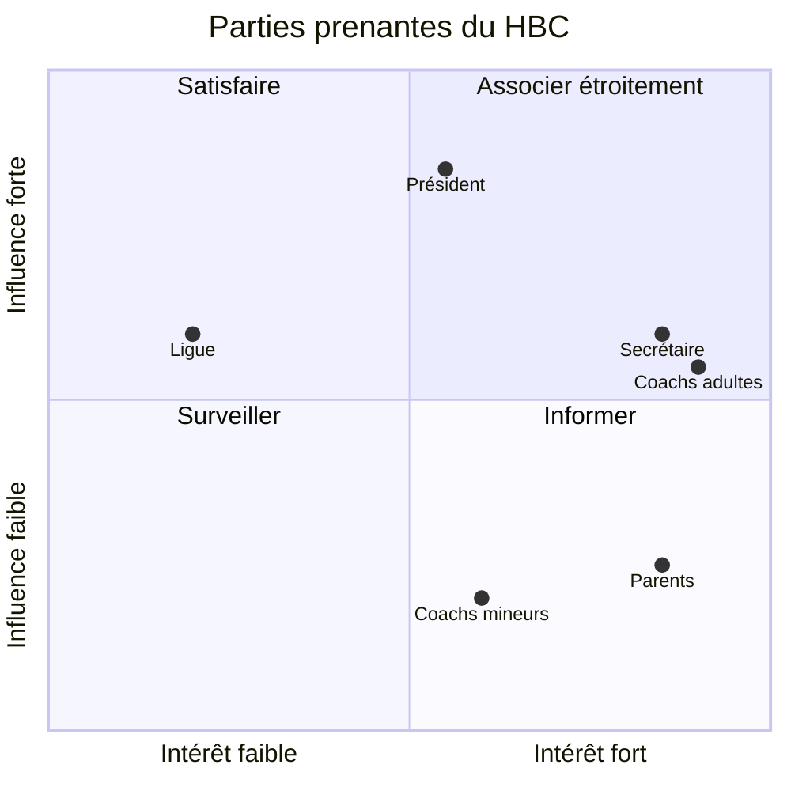

# C1 — Carte des parties prenantes · *exemple rédigé*

> **Concevoir** · Phase 1 Recueillir · à rendre pour **J1**
>
> Cas : HBC Val-de-Furan · Équipe : exemple

## 1. Qui est concerné ?

| Partie prenante | Rôle dans l'organisation | Ce qu'elle attend | Ce qu'elle craint | Influence (1-3) | Intérêt (1-3) | Interrogée ? |
|---|---|---|---|---|---|---|
| Alain, président | Décide avec le bureau, signe les dépenses | Moins de forfaits, image « moderne » du club | Dépenser pour un outil que personne n'utilise | 3 | 2 | à planifier |
| Nadège, secrétaire | Gère les licences et les contacts des familles | Ne plus être « le standard » du club le vendredi soir | Encore un outil à tenir à jour | 2 | 3 | oui |
| Entraîneurs adultes (8) | Convoquent, organisent les déplacements | Savoir **mercredi** qui vient samedi | Perdre du temps à apprendre un outil | 2 | 3 | oui (1 coach U13) |
| Entraîneurs mineurs (4) | Encadrent les U9-U11 | Ne pas avoir à relancer des adultes | Être mis de côté | 1 | 2 | non → à planifier |
| Parents des jeunes (≈ 100 familles) | Répondent, conduisent | Une info claire et à l'avance | Une appli de plus, des notifications | 1 | 3 | oui (1 parent) |
| Joueurs mineurs | Jouent | Jouer à 7, pas à 5 | — | 1 | 3 | non (via parents) |
| Ligue régionale de handball | Publie le calendrier, inflige les amendes | Que le club se présente aux matchs | — | 2 | 1 | non (documents publics) |

> 💡 **Pourquoi ?** Le besoin a été exprimé par le **président**, mais ceux qui vivent le problème sont les **entraîneurs** et les **parents**. Les entraîneurs mineurs n'apparaissent nulle part dans le message : ce sont des oubliés typiques.

## 2. Matrice influence / intérêt

## 3. Qui décide, qui paie, qui utilise ?

- **Décideur** : le bureau (vote), porté par Alain.
- **Financeur** : le club (budget de fonctionnement) ; pas de subvention identifiée.
- **Utilisateurs principaux** : entraîneurs et parents.
- **Personnes dont on traite les données sans être utilisatrices** : les joueurs mineurs.

## 4. Plan d'entretiens

| Qui | Pourquoi elle (qu'apprendra-t-on d'elle ?) | Quand | Qui mène / qui note |
|---|---|---|---|
| Un coach U13 | Comment se passe une semaine de convocation, en vrai | Séance 2, 1er créneau | Léa / Hugo |
| Nadège | Les données des familles, ce qui existe déjà | Séance 2 | Hugo / Léa |
| Un parent | Pourquoi on ne répond pas | Séance 3 | Samir / Léa |
| Alain | Budget, critères de décision | Séance 3 | Samir / Hugo |

---
**Critères de qualité** — [x] au moins une partie prenante non citée dans le besoin exprimé · [x] décideur ≠ utilisateur identifié · [x] chaque entretien planifié a un objectif
**Usage de l'IA** : nous avons demandé une liste de parties prenantes « d'un club sportif amateur » ; elle a proposé la Ligue et les sponsors. Ligue gardée, sponsors écartés (pas concernés).
