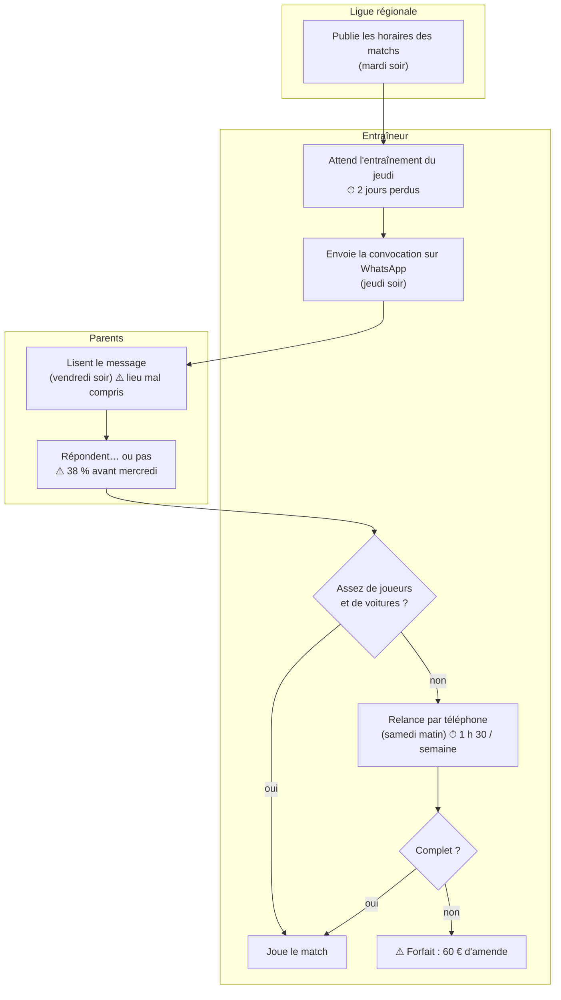
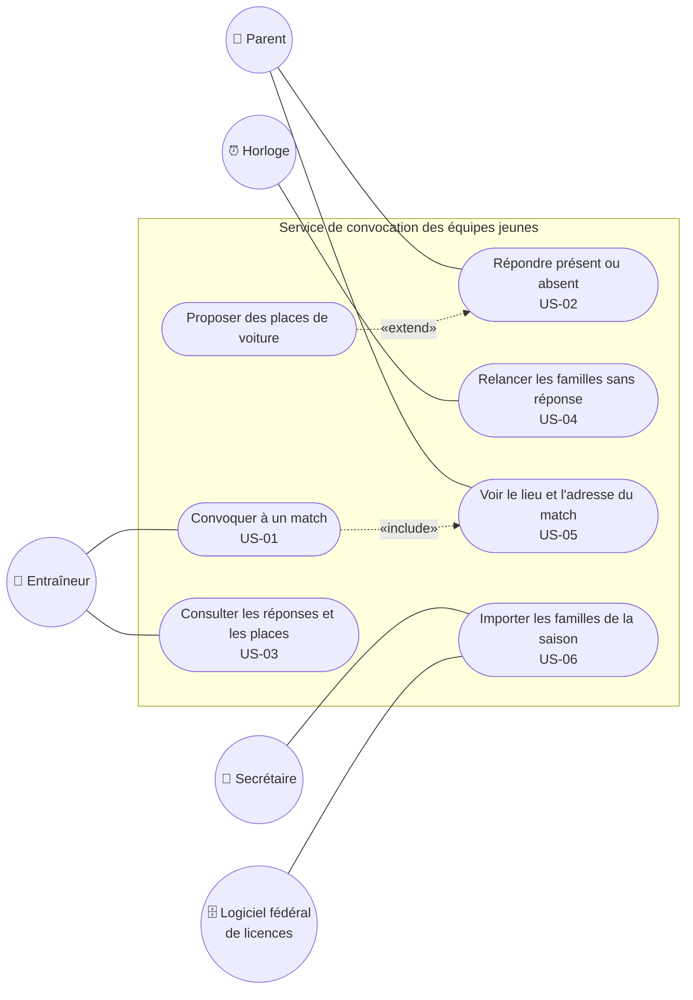

# C4 — Fiche besoins · *exemple rédigé*

> **Concevoir** · Phase 2 Analyser · à rendre pour **J2**

## 1. Le besoin exprimé, et ce qu'il cache

| Ce que le client a demandé (mot pour mot) | Le problème réel derrière | Source (C3) |
|---|---|---|
| « Une appli pour les convocations » | La convocation part **2 jours trop tard** et les réponses arrivent la veille du match | C3 coach V1-V3 |
| « …et le covoiturage » | Sans 3 conducteurs, l'équipe ne peut pas se déplacer ; on le découvre le vendredi | C3 coach V4 |
| « Les parents ne répondent pas » | Les parents répondent, mais **tard**, et le lieu du match est mal compris | C3 coach V3, V5 ; C3 parent |
| « Si vos étudiants peuvent nous la développer » | Une solution est attendue, **pas forcément un développement** | message du président |

## 1 bis. Le processus actuel (diagramme d'activité UML)



> 💡 **Pourquoi ?** Le diagramme rend visible ce que le client ne voyait pas : **l'information existe dès le mardi**, mais la convocation part le jeudi. Chaque ⚠ et ⏱ renvoie à un constat du [C3](C3-compte-rendu-coach.md) ou à un chiffre de [M1](M1-indicateurs.md).

## 2. L'énoncé du besoin en une phrase

> **Pour** les entraîneurs des équipes jeunes **qui** découvrent la veille du match qu'ils n'auront ni assez de joueurs ni assez de conducteurs, **nous proposons de** connaître dès le mercredi soir les présents et les conducteurs de chaque match **afin de** supprimer les forfaits et de réduire le temps de relance.

> 💡 **Pourquoi ?** La phrase ne contient **ni « appli », ni « WhatsApp », ni aucune technologie**. Elle décrit un résultat. C'est ce qui permettra, à l'étape 11, de comparer honnêtement une application, un outil existant… ou une simple règle d'organisation.

## 3. Périmètre

| Dans le périmètre | Hors périmètre (et pourquoi) |
|---|---|
| Convocations des 9 équipes jeunes, réponses, conducteurs | Équipes adultes (pas de forfait, s'organisent seules) |
| Rappel automatique aux familles sans réponse | Gestion des licences (déjà faite dans le logiciel fédéral) |
| Information claire du lieu (domicile / extérieur + adresse de la salle) | Certificats médicaux (données de santé : ne doivent pas circuler par cet outil) |

## 4. Récits utilisateur et critères d'acceptation

| ID | En tant que… | je veux… | afin de… | MoSCoW | Ticket |
|---|---|---|---|---|---|
| US-01 | entraîneur | envoyer une convocation en moins de 5 min dès que l'horaire est connu | de laisser 3 jours aux familles pour répondre | **Must** | #7 |
| US-02 | parent | répondre présent / absent en un geste | de ne pas avoir à écrire un message | **Must** | #8 |
| US-03 | entraîneur | voir d'un coup d'œil qui a répondu et qui conduit | de savoir mercredi soir si l'équipe est complète | **Must** | #9 |
| US-04 | parent | recevoir un rappel si je n'ai pas répondu mardi soir | de ne pas oublier | Should | #10 |
| US-05 | parent | voir si le match est à domicile ou à l'extérieur, avec l'adresse | de ne pas me tromper de salle | Should | #11 |
| US-06 | secrétaire | ne pas ressaisir les familles à chaque saison | de ne pas y passer mes soirées de septembre | Could | #12 |
| US-07 | président | un tableau des forfaits de la saison | de suivre l'effet du projet | Won't (cette fois) | — |

Critères d'acceptation des récits **Must** :

```gherkin
Fonctionnalité: US-02 Répondre à une convocation
  Scénario: un parent répond présent depuis son téléphone
    Étant donné que Léo (U13) est convoqué au match de samedi 14 h à Rive-de-Gier
    Et que sa mère a reçu la convocation mardi soir
    Quand elle indique « présent » et « je peux conduire 3 enfants »
    Alors l'entraîneur voit Léo « présent » et 3 places de voiture disponibles
    Et la mère n'a eu à saisir aucun texte
```

```gherkin
Fonctionnalité: US-03 Vue de l'entraîneur
  Scénario: l'équipe est incomplète mercredi soir
    Étant donné 14 joueurs convoqués, 6 présents, 2 absents et 6 sans réponse
    Quand l'entraîneur ouvre la convocation mercredi à 20 h
    Alors il voit les 6 sans réponse en tête de liste
    Et le nombre de places de voiture confirmées
```

## 4 bis. Diagramme de cas d'utilisation



> 💡 **Pourquoi ?** L'**horloge** est un acteur : la relance est déclenchée par le temps, pas par une personne. Le **logiciel fédéral** est un acteur externe : on ne le remplace pas, on en importe les données. Aucune application n'est nommée : ce diagramme vaut pour S0, S1 ou S2.

## 4 ter. Description des cas d'utilisation

### UC-01 — Convoquer à un match

- **Acteur principal** : entraîneur · **Acteurs secondaires** : parents, horloge
- **Récit(s) lié(s)** : US-01, US-04, US-05 · **Priorité** : Must
- **Objectif** : que toutes les familles de l'équipe connaissent l'heure, le lieu et le point de départ du match au plus tôt.
- **Déclencheur** : la Ligue publie l'horaire du match (mardi soir en général).
- **Préconditions** : l'équipe et ses familles sont enregistrées ; l'entraîneur est identifié et rattaché à l'équipe.

**Scénario nominal**
1. L'entraîneur indique le match : adversaire, date, heure, lieu, domicile ou extérieur, heure de départ du parking.
2. Le système affiche la liste des joueurs de l'équipe, tous cochés « convoqués ».
3. L'entraîneur décoche les joueurs absents connus (blessés…) et valide.
4. Le système envoie la convocation à chaque famille, avec l'adresse de la salle.
5. Le système programme un rappel pour le mardi 21 h.

**Scénarios alternatifs**
- 1a. L'horaire n'est pas encore publié : l'entraîneur crée une convocation « horaire à confirmer » ; le système prévient les familles lors de la mise à jour.
- 5a. Mardi 21 h, une famille n'a pas répondu : le système lui envoie un rappel (UC-01 est étendu par « Relancer les familles sans réponse »).
- 4a. Une famille n'a pas de smartphone : le système signale à l'entraîneur qu'il doit la prévenir par téléphone.

**Exceptions**
- Le match est annulé : l'entraîneur annule la convocation ; le système prévient toutes les familles.

- **Postconditions** : chaque famille convoquée a reçu l'information (ou l'entraîneur sait qui prévenir autrement) ; un rappel est programmé.
- **Données manipulées (→ S1)** : prénom, nom et équipe des joueurs ; coordonnées des parents (non visibles des autres familles).
- **Règles de gestion** : un entraîneur ne convoque que **son** équipe ; convocation au plus tard le mardi 22 h (KPI-01).

### UC-02 — Répondre à une convocation

- **Acteur principal** : parent · **Acteur secondaire** : entraîneur
- **Récit(s) lié(s)** : US-02, US-03 · **Priorité** : Must
- **Objectif** : indiquer si l'enfant sera présent et combien de places de voiture sont proposées.
- **Déclencheur** : réception de la convocation ou du rappel.
- **Préconditions** : la famille a été convoquée (UC-01).

**Scénario nominal**
1. Le parent ouvre la convocation.
2. Le système affiche le match : date, heure, lieu, domicile ou extérieur, départ du parking.
3. Le parent choisit « présent ».
4. Le système propose d'indiquer des places de voiture (facultatif).
5. Le parent indique 3 places et valide.
6. Le système enregistre la réponse et met à jour le tableau de l'entraîneur.

**Scénarios alternatifs**
- 3a. Le parent choisit « absent » : le système enregistre la réponse sans proposer de places ; fin.
- 6a. Le parent change d'avis plus tard : il modifie sa réponse ; le système prévient l'entraîneur si le match a lieu dans moins de 48 h.

**Exceptions**
- La convocation a été annulée : le système affiche « match annulé » et n'enregistre rien.

- **Postconditions** : la réponse est visible de l'entraîneur ; les places de voiture sont comptées.
- **Données manipulées (→ S1)** : réponse (présent / absent), nombre de places.
- **Règles de gestion** : les autres familles voient les prénoms des présents et le nombre de places, **jamais** les coordonnées (ENF-03).

> 💡 **Pourquoi ?** Le scénario nominal alterne **acteur / système**, une action par ligne. Chaque alternative (1a, 4a, 5a, 3a, 6a) et chaque exception est devenue un test de la [recette M2](M2-cahier-recette.md) : c'est ainsi qu'on vérifie qu'on n'a rien oublié.

## 5. Exigences non fonctionnelles

| ID | Catégorie | Exigence (mesurable) | Justification |
|---|---|---|---|
| ENF-01 | Utilisabilité | Un parent sans formation répond en moins de 30 secondes sur téléphone | C3 parent : « si c'est compliqué je ne le ferai pas » |
| ENF-02 | Accessibilité | Une famille sans smartphone peut répondre par SMS ou être saisie par l'entraîneur | 2 familles concernées en U13 (C3 coach) |
| ENF-03 | Sécurité / RGPD | Les parents ne voient pas les coordonnées des autres familles | S1 : C=2 aujourd'hui non respecté |
| ENF-04 | Coût | ≤ 100 € par an | budget indiqué par le président |
| ENF-05 | Réversibilité | Export de la liste des familles en CSV à tout moment | le club doit pouvoir changer d'outil |

## 6. Hypothèses et points non tranchés

- Hypothèse : les entraîneurs mineurs utiliseront le même outil que les adultes (à confirmer avec eux).
- Non tranché : faut-il inclure les matchs amicaux ?

---
**Critères de qualité** — [x] aucune technologie nommée dans l'énoncé du besoin · [x] ≤ 40 % des récits en Must (3 / 7) · [x] chaque Must a un critère Gherkin (US-01 : voir ticket #7) · [x] les ENF sont chiffrées · [x] processus actuel et cas d'utilisation dessinés · [x] une fiche descriptive par cas d'utilisation Must
**Usage de l'IA** : nous avons demandé des idées d'exigences non fonctionnelles ; gardé ENF-05 (réversibilité), que nous n'avions pas pensé à écrire.
