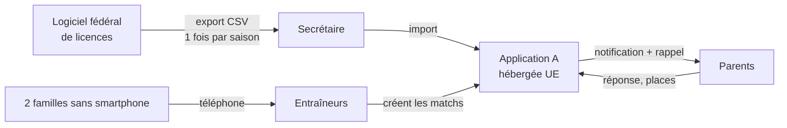
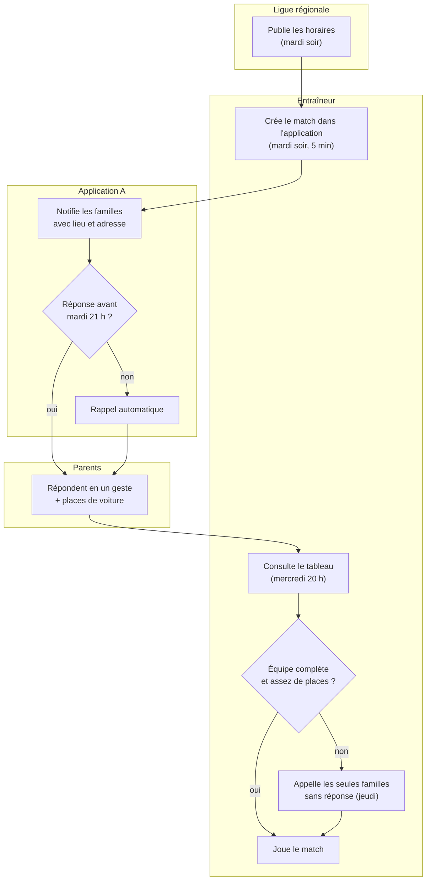
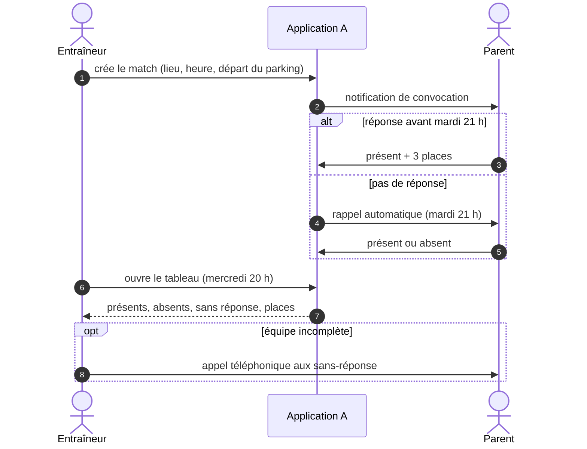
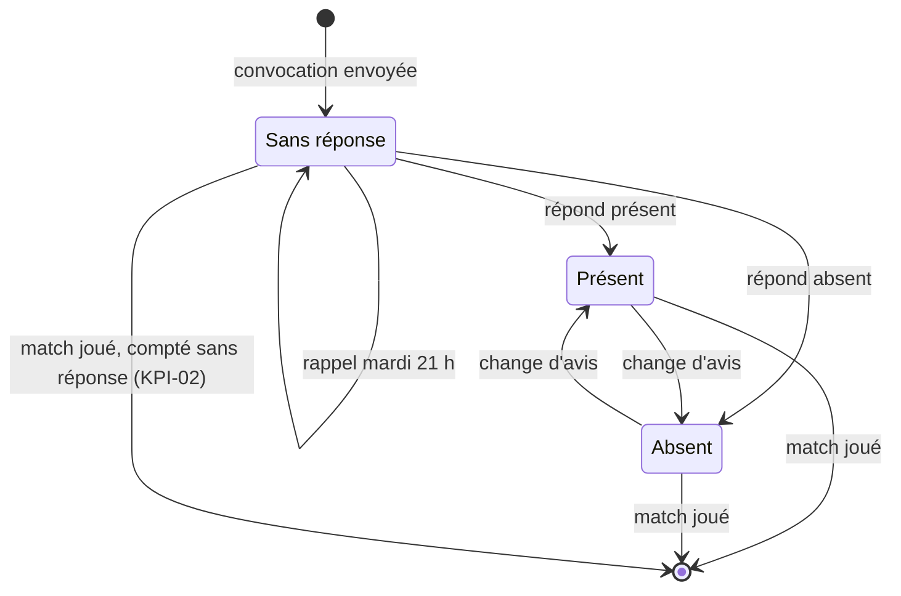

# C6 — Dossier de solution · *exemple rédigé*

> **Concevoir** · Phase 4 Préparer la mise en place · à rendre pour **J3**

## 1. La solution retenue en une page

Les 3 équipes pilotes (U11, U13, U15) utilisent l'**application A** (offre gratuite associations), configurée aux couleurs du club. L'entraîneur crée l'événement du match le **mardi soir** (lieu, heure, adresse de la salle, heure de départ du parking). Les parents répondent en un geste et indiquent leurs places de voiture ; un rappel part automatiquement le mardi 21 h aux familles sans réponse. Les 2 familles sans smartphone répondent par téléphone à l'entraîneur, qui saisit leur réponse. Toutes les autres équipes appliquent la **règle du mardi** (S0) en attendant la généralisation.

## 2. Maquettes des écrans clés

| Récit | Écran | Lien / image |
|---|---|---|
| US-01 | Création d'un match par l'entraîneur | [captures de la configuration de test](annexes/) (non fournies dans l'exemple) |
| US-02 | Réponse d'un parent (présent / absent / places) | idem |
| US-03 | Tableau de l'entraîneur : présents, absents, sans réponse, places | idem |

> 💡 **Pourquoi ?** Quand la solution est un outil du marché, la « maquette » est une **capture de l'outil configuré** sur un compte de test, avec des données fictives — pas un écran inventé.

## 3. Architecture

- Hébergement : chez l'éditeur, UE (selon ses conditions ; contrat de sous-traitance signé par le président).
- Comptes et droits : secrétaire + trésorier administrateurs ; entraîneurs gérant **leur seule équipe** ; parents (→ S3 §3).
- Interfaces avec l'existant : import CSV depuis l'export du logiciel de licences, une fois par saison.

## 3 bis. Le processus cible (diagramme d'activité UML)

> 💡 **Pourquoi ?** Comparez avec le [processus actuel de C4](C4-fiche-besoins.md) : les 2 jours perdus ont disparu (convocation le mardi), la relance est automatique, et l'entraîneur n'appelle plus que les familles sans réponse.

## 3 ter. Le scénario principal (diagramme de séquence UML)

## 3 quater. États de la réponse d'un joueur

> 💡 **Pourquoi ?** L'état « Sans réponse » à la fin du match alimente directement l'indicateur KPI-02 de [M1](M1-indicateurs.md) : le diagramme montre d'où vient la mesure.

## 4. Décisions structurantes (ADR)

### ADR-01 — Outil du marché plutôt que développement
- **Contexte** : aucun bénévole ne peut maintenir une application ; l'équipe étudiante part en juin.
- **Options** : S0 seul, application A, développement sur mesure.
- **Décision** : application A + S0 en filet.
- **Conséquences** : + gratuit, disponible en novembre ; − dépendance à l'éditeur (parade : export mensuel, R-03).

### ADR-02 — Comptes au nom des parents, pas des enfants
- **Contexte** : joueurs de 9 à 17 ans ; le consentement d'un mineur de moins de 15 ans à un service en ligne nécessite l'accord parental.
- **Options** : comptes enfants, comptes parents, comptes mixtes selon l'âge.
- **Décision** : comptes parents pour tous les joueurs jeunes ; les U18 peuvent être ajoutés comme second contact avec l'accord des parents.
- **Conséquences** : + simple et conforme ; − les U18 dépendent de leurs parents pour répondre.

## 5. Reprise des données existantes

| Source actuelle | Volume | Qualité | Méthode de reprise |
|---|---|---|---|
| Export du logiciel de licences | 112 joueurs, ≈ 170 contacts | bonne ; 9 e-mails manquants | import CSV, colonnes : prénom, nom, équipe, e-mail et téléphone des parents |
| Groupes WhatsApp | 3 groupes | **non repris** | fermés aux convocations 3 semaines après le lancement |

---
**Critères de qualité** — [x] chaque Must a son écran · [x] au moins 2 ADR · [x] hébergement et localisation des données précisés · [x] reprise de l'existant traitée · [x] processus cible et scénario principal dessinés
**Usage de l'IA** : aucun.
