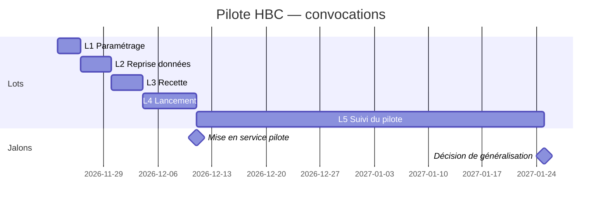

# P1 — Plan de projet · *exemple rédigé*

> **Piloter** · Phase 4 · à rendre pour **J3**

## 1. Objectif et échéance

Mettre en service l'application A pour 3 équipes pilotes avant la reprise de janvier (phase retour du championnat), puis décider de la généralisation au bureau de février.

## 2. Découpage en lots

| Lot | Contenu | Livrable | Charge (h) | Prérequis |
|---|---|---|---|---|
| L1 | Paramétrage : club, 3 équipes, rôles, désactivation photo et date de naissance | compte configuré | 4 | GO J2, contrat de sous-traitance signé |
| L2 | Reprise des données : export licences, nettoyage, import test puis complet | 3 équipes importées | 3 | L1 |
| L3 | Recette avec 1 entraîneur et 3 parents volontaires | PV de recette (M2) | 3 | L2 |
| L4 | Formation et lancement : tutoriel d'une page, réunion parents, QR code | familles inscrites | 6 | L3 |
| L5 | Suivi du pilote : relevé mensuel des indicateurs | tableau KPI | 2 | L4 |
| | | | **18 h** | |

## 3. Jalons et planning

## 4. RACI

| Activité | Président | Secrétaire | Coach référent | Équipe projet (étudiants) |
|---|---|---|---|---|
| Signer le contrat de sous-traitance | **A/R** | C | I | C |
| Paramétrer l'application | I | A | C | R |
| Importer les familles | I | **A** | C | R |
| Exécuter la recette | I | C | **A/R** | C |
| Animer la réunion parents | A | C | R | C |
| Relever les indicateurs | I | **A/R** | I | C |
| Décider la généralisation | **A/R** | C | C | I |

> 💡 **Pourquoi ?** Un seul **A** par ligne : c'est la personne qui rend des comptes. Les étudiants sont **R** (ils font) mais jamais **A** sur une décision du club.

## 5. Budget

| Poste | Montant | Qui paie |
|---|---|---|
| Application A (offre associations) | 0 € | — |
| Impression tutoriel + affiche QR code | 15 € | club |
| Temps bénévole (formation, administration) | ≈ 12 h | — |

## 6. Gouvernance

- Point d'avancement : 15 min au début de chaque séance BTS ; point avec Nadège par e-mail chaque vendredi.
- Arbitrage d'un désaccord sur le périmètre : le président.

---
**Critères de qualité** — [x] charges chiffrées · [x] un seul A par ligne du RACI · [x] jalons présents dans GitHub · [x] budget cohérent avec C5
**Usage de l'IA** : aucun.
