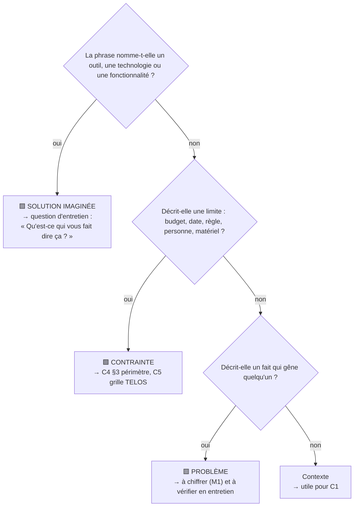

# Étape 1 — Lire le besoin exprimé (sans proposer de solution)

> Phase 1 Recueillir · **Concevoir** · Pas d'artefact dédié : vos notes alimentent C1 et C2 · ⏱ 45 min

## Pourquoi cette étape ?

Le document `besoin-exprime.md` de votre cas est ce que le client vous a dit **avant** que vous ne l'interrogiez. Il mélange presque toujours trois choses : des **problèmes** (ce qui fait mal), des **solutions** (ce que le client imagine) et des **contraintes** (budget, délai, personnes). Votre premier travail est de les séparer. Si vous partez de la solution demandée (« une appli »), vous ferez peut-être la mauvaise chose très bien.

## Ce dont vous avez besoin

| Cas | À lire, dans cet ordre |
|---|---|
| 1 — SPA | [README](../cas/01-spa-forez-pilat/README.md) → [besoin exprimé](../cas/01-spa-forez-pilat/besoin-exprime.md) → [extrait WhatsApp](../cas/01-spa-forez-pilat/documents/extrait-whatsapp.md) → [formulaire d'adoption](../cas/01-spa-forez-pilat/documents/formulaire-adoption-actuel.md) |
| 2 — Mairie | [README](../cas/02-mairie-saint-roch/README.md) → [besoin exprimé](../cas/02-mairie-saint-roch/besoin-exprime.md) → [règlement des salles](../cas/02-mairie-saint-roch/documents/extrait-reglement-salles.md) |
| 3 — Kiné | [README](../cas/03-cabinet-kine-tilleuls/README.md) → [besoin exprimé](../cas/03-cabinet-kine-tilleuls/besoin-exprime.md) |
| 4 — Traiteur | [README](../cas/04-traiteur-maison-berard/README.md) → [besoin exprimé](../cas/04-traiteur-maison-berard/besoin-exprime.md) → [mail de l'incident](../cas/04-traiteur-maison-berard/documents/incident-allergene.md) |
| 5 — Office de tourisme | [README](../cas/05-office-tourisme-hautes-chaumes/README.md) → [besoin exprimé](../cas/05-office-tourisme-hautes-chaumes/besoin-exprime.md) → [FAQ interne](../cas/05-office-tourisme-hautes-chaumes/documents/faq-interne.md) |

Les fichiers CSV serviront à l'étape 5 : ouvrez-les juste pour voir les colonnes.

## Comment faire, pas à pas

1. **Lisez une première fois** le besoin exprimé en entier, sans rien noter.
2. **Relisez avec trois surligneurs** (dans une copie ou sur papier) :
   - 🟥 **Problème** : un fait qui gêne quelqu'un (« on perd des candidatures », « double réservation ») ;
   - 🟦 **Solution** : une technologie ou un outil imaginé (« une appli », « une IA », « un site où… ») ;
   - 🟩 **Contrainte** : budget, date, personnes, règles (« zéro euro », « avant mars », « je n'ai pas de smartphone »).
3. **Remplissez ce tableau** dans une note d'équipe (brouillon, pas un livrable) :

   | Phrase du document | 🟥 / 🟦 / 🟩 | Qui l'a dit | Question à poser en entretien |
   |---|---|---|---|
   | « Il nous faut une appli » | 🟦 | présidente | « Qu'est-ce qui, aujourd'hui, vous fait dire ça ? » |

4. **Pour chaque 🟦, écrivez la question qui remonte au problème** : « Si vous aviez cette appli, qu'est-ce qui changerait pour vous ? » ; « Racontez-moi la dernière fois où ça a posé problème. »
5. **Listez les contradictions** (deux personnes qui veulent l'inverse) et les **oublis** (qui n'a pas parlé ? de quoi personne ne parle — données, sécurité, qui maintiendra ?).
6. **Notez les chiffres présents** et ceux qui manquent : ils iront dans M1.

## 🗺️ En schéma

### Classer une phrase du besoin exprimé

> Tous les schémas : [diagrammes UML](schemas-uml.md) · [arbres de décision](arbres-de-decision.md)

## Exemple

Dans le [mini-cas du club de handball](../exemples/hbc-val-de-furan/README.md), « une appli pour les convocations » (🟦) cache le problème « les réponses arrivent la veille du match » (🟥), et « 60 € d'amende par forfait » est un chiffre précieux pour M1.

## Pièges à éviter

- Commencer à chercher des logiciels **maintenant**. Ce sera l'étape 11.
- Croire que la personne qui écrit est celle qui vit le problème.
- Prendre au sérieux uniquement ce qui est écrit en premier ou par le chef.

## J'ai fini quand…

- [ ] chaque phrase importante est classée problème / solution / contrainte ;
- [ ] j'ai au moins 5 questions à poser, dont une par « solution » exprimée ;
- [ ] j'ai repéré au moins une contradiction et un oubli.

---
[← Étape 0](E00-installer-equipe-et-depot.md) · [Parcours](../METHODE.md) · [Étape 2 — Parties prenantes →](E02-parties-prenantes.md)
