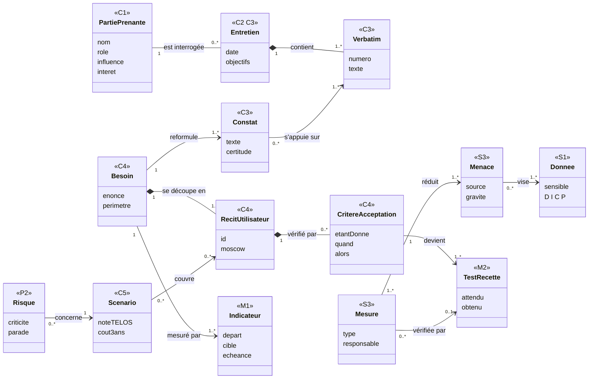

# Étape 7 — Reformuler le besoin

> Phase 2 Analyser · **Concevoir** · Artefact : [C4 Fiche besoins](../modeles/C4-fiche-besoins.md), §1 à §3 · Jalon **J2** · ⏱ 1 h

## Pourquoi cette étape ?

Vous avez maintenant des comptes rendus, des chiffres et un inventaire des données. Il faut en tirer **une** description du besoin, sur laquelle toute la suite va s'appuyer : les récits utilisateur, les indicateurs, la comparaison des solutions. Si cette description contient déjà une technologie (« une appli qui… »), vous aurez décidé de la solution sans l'avoir étudiée.

## Ce dont vous avez besoin

- Tous vos [C3](../modeles/C3-compte-rendu-entretien.md) validés, surtout les §2 (constats).
- [M1](../modeles/M1-indicateurs.md) §1 (les chiffres de l'avant).
- Vos notes de l'[étape 1](E01-lire-le-besoin-exprime.md) (problème / solution / contrainte).

## Comment faire, pas à pas

1. **Copiez le modèle** : `cp modeles/C4-fiche-besoins.md livrables/`.
2. **§1 — Le besoin exprimé et ce qu'il cache** : reprenez chaque « solution » demandée par le client (🟦 de l'étape 1) et, en face, **le problème réel** que vos entretiens ont révélé, avec la source. C'est souvent ici qu'apparaît le problème que personne n'a mis en avant.
3. **§1 bis — Dessinez le processus actuel** en diagramme d'activité UML, un couloir par acteur, à partir de vos C3. Marquez d'un ⚠ ou d'un ⏱ les endroits où l'information se perd ou attend. Ces marques doivent correspondre à des constats de vos C3 : si vous en ajoutez une sans source, c'est une hypothèse à vérifier. Gabarit : [aide-mémoire UML §1](aide-memoire-uml-mermaid.md#1-diagramme-dactivité-avec-couloirs-par-acteur) ; exemple : [C4 du club, §1 bis](../exemples/hbc-val-de-furan/C4-fiche-besoins.md).
4. **Regroupez les constats** de tous vos C3 par thème (post-it, tableau blanc, ou un tableau à deux colonnes « constat → thème »). Classez les thèmes par **gravité** (conséquences, chiffres de M1) et **fréquence**.
5. **§2 — L'énoncé en une phrase**, avec la formule :

   > **Pour** [qui] **qui** [a quel problème], **nous proposons de** [résultat attendu, sans technologie] **afin de** [bénéfice mesurable].

   Test : remplacez mentalement votre future solution par une feuille de papier bien organisée. Si la phrase reste vraie, elle est bien écrite.
6. **§3 — Périmètre** : ce qui est **dedans**, et surtout ce qui est **dehors, avec la raison**. Le « hors périmètre » évite de promettre tout à tout le monde (fréquent avec 7 interlocuteurs qui veulent 7 choses).
7. **Faites relire la phrase au client** (ticket, dans son rôle) avant de continuer. C'est la « reformulation signée » du jalon.

## 🗺️ En schéma

### Diagramme de classes — comment les artefacts s'enchaînent (traçabilité)

Chaque classe est une notion de la méthode ; l'étiquette `<<C3>>` indique dans quel artefact on la trouve. Les multiplicités (`1`, `0..*`, `1..*`) se lisent : « un besoin se découpe en **un ou plusieurs** récits ». Le losange plein (composition) signifie que l'élément n'existe pas sans son parent.

> Tous les schémas : [diagrammes UML](schemas-uml.md) · [arbres de décision](arbres-de-decision.md)

## Exemple

[C4 du club de handball, §1 à §3](../exemples/hbc-val-de-furan/C4-fiche-besoins.md) : « une appli pour les convocations » devient « connaître dès le mercredi soir les présents et les conducteurs ».

## Pièges à éviter

- Garder tous les souhaits de tous les interlocuteurs : **choisir**, c'est aussi votre travail. Le reste va en « hors périmètre » ou en « Could / Won't » (étape 8).
- Écrire un énoncé tellement général qu'il ne sert à rien (« améliorer la communication »).
- Oublier le bénéfice **mesurable** : il deviendra un indicateur à l'étape 9.

## J'ai fini quand…

- [ ] chaque solution demandée a son problème réel en face ;
- [ ] le processus actuel est dessiné, avec ses ⚠ reliés aux C3 ;
- [ ] l'énoncé tient en une phrase et ne nomme aucune technologie ;
- [ ] le hors-périmètre est justifié ;
- [ ] le client a relu la phrase.

---
[← Étape 6](E06-donnees-et-dicp.md) · [Parcours](../METHODE.md) · [Étape 8 — Récits utilisateur et priorités →](E08-recits-gherkin-moscow.md)
