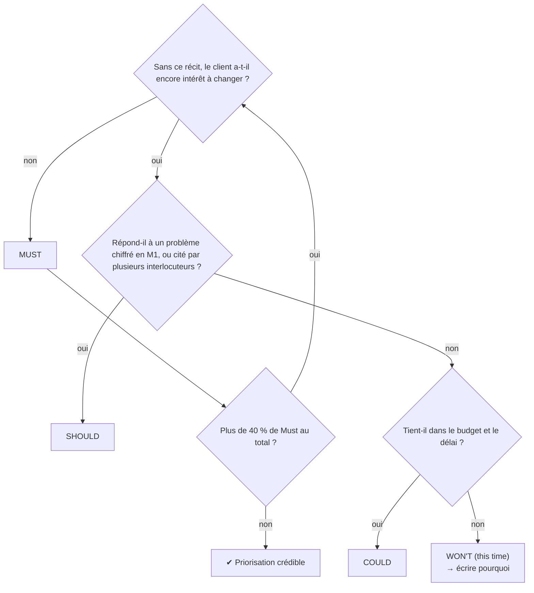
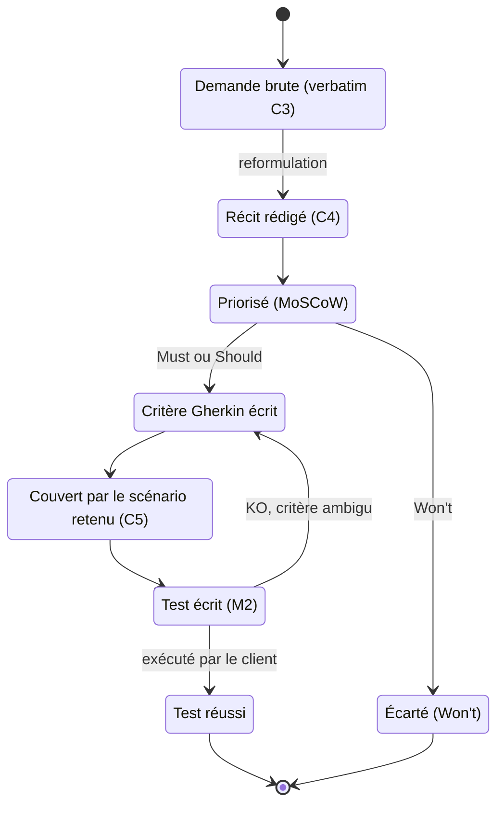

# Étape 8 — Écrire les récits utilisateur, leurs critères d'acceptation et les prioriser

> Phase 2 Analyser · **Concevoir** · Artefact : [C4 Fiche besoins](../modeles/C4-fiche-besoins.md), §4 à §6 · Jalon **J2** · ⏱ 1 h 30

## Pourquoi cette étape ?

L'énoncé du besoin (étape 7) dit **quoi** obtenir. Les récits utilisateur disent **qui fait quoi, et pourquoi**, en petits morceaux qu'on peut prioriser, comparer d'une solution à l'autre (étape 12) et tester (étape 19). Les critères d'acceptation rendent chaque récit **vérifiable** : sans eux, « ça marche » n'a pas de sens.

## Ce dont vous avez besoin

- C4 §1-3 ([étape 7](E07-reformuler-le-besoin.md)).
- Vos [C3](../modeles/C3-compte-rendu-entretien.md) : chaque récit doit pouvoir citer sa source.
- Le modèle de ticket **Récit utilisateur** du dépôt (*Issues → New issue*).

## Comment faire, pas à pas

### 1. Écrire les récits

Formule : **En tant que** [rôle précis] **je veux** [action] **afin de** [bénéfice].

| ❌ Mal écrit | ✅ Bien écrit | Pourquoi |
|---|---|---|
| En tant qu'utilisateur, je veux une base de données | En tant que bibliothécaire, je veux mettre un document de côté pour un lecteur afin qu'il ne soit pas prêté à quelqu'un d'autre avant son passage | rôle précis, action observable, bénéfice |
| En tant que lecteur, je veux une appli rapide | En tant que lecteur, je veux être prévenu dans l'heure où mon livre réservé est disponible afin de venir le chercher avant la fermeture | « rapide » est chiffré |
| En tant qu'admin, je veux gérer | *(trop vague : découper en 2 ou 3 récits)* | |

Visez **6 à 12 récits**. Un récit = un ticket GitHub (étiquette `recit`, jalon J2).

### 2. Prioriser avec MoSCoW

| Priorité | Signification | Règle pratique |
|---|---|---|
| **Must** | sans lui, la solution ne répond pas au besoin | ≤ 40 % des récits |
| **Should** | important, mais on peut démarrer sans | |
| **Could** | appréciable si le temps et le budget le permettent | |
| **Won't (this time)** | écarté **pour cette fois**, avec la raison | au moins un : c'est la preuve que vous avez choisi |

Pour trancher entre Must et Should, demandez-vous : « Si seul ce récit manque, le client a-t-il encore un intérêt à changer ? »

### 3. Écrire les critères d'acceptation (Gherkin) pour chaque Must

```gherkin
Fonctionnalité: US-03 Mettre un document de côté
  Scénario: la bibliothécaire réserve un livre pour un lecteur
    Étant donné que « Le Petit Prince » est disponible en rayon
    Et que Mme Durand l'a demandé par téléphone
    Quand la bibliothécaire le met de côté pour Mme Durand jusqu'à samedi
    Alors le livre apparaît « réservé » pour tous les autres lecteurs
    Et Mme Durand reçoit un message avec la date limite de retrait
```

- **Étant donné** : la situation de départ, avec des données concrètes (fictives) ;
- **Quand** : une seule action ;
- **Alors** : un résultat **observable** par quelqu'un qui n'a pas construit la solution.

Ajoutez au besoin un 2e scénario pour le cas d'erreur (« Scénario: un autre lecteur tente d'emprunter le livre mis de côté »).

### 4. Diagramme de cas d'utilisation (§4 bis)

Une fois les récits écrits, dessinez **qui utilise le futur service et pour quoi faire** : un acteur par rôle de vos récits (« En tant que… »), un cas d'utilisation par récit Must (et Should si possible). N'oubliez pas les acteurs non humains : un autre logiciel dont on importe les données, ou **le temps** pour une tâche automatique (rappel, relance). Utilisez `«include»` quand un cas en contient toujours un autre, `«extend»` quand il s'y ajoute sous condition. Gabarit : [aide-mémoire UML §2](aide-memoire-uml-mermaid.md#2-diagramme-de-cas-dutilisation) ; exemple : [C4 du club, §4 bis](../exemples/hbc-val-de-furan/C4-fiche-besoins.md).

### 5. Exigences non fonctionnelles (§5)

Ce n'est pas *ce que fait* la solution, mais *comment* elle doit le faire. **Chiffrez-les** :
utilisabilité (« en moins de 2 minutes sur téléphone, sans formation »), disponibilité (« consultable à l'ouverture, même en cas de panne d'internet »), sécurité (reliée à S1), coût (« ≤ 1 500 € sur 3 ans »), réversibilité (« export complet en CSV »), accessibilité.

## 🗺️ En schéma

### Must, Should, Could ou Won't ?



Si vous avez trop de Must, repassez chaque Must dans l'arbre en étant plus sévères.

### Diagramme d'états-transitions — d'une phrase du client à un test réussi



Ce diagramme montre la **traçabilité** : chaque test de recette doit pouvoir remonter jusqu'à une phrase prononcée par le client.

> Tous les schémas : [diagrammes UML](schemas-uml.md) · [arbres de décision](arbres-de-decision.md)

## Exemple

[C4 du club de handball, §4 à §6](../exemples/hbc-val-de-furan/C4-fiche-besoins.md) : 7 récits, 3 Must, 1 Won't, 2 scénarios Gherkin, 5 ENF chiffrées.

## Pièges à éviter

- Écrire des récits qui décrivent une technique (« je veux une API »).
- Tout mettre en Must pour faire plaisir à tout le monde.
- Des critères « Alors ça fonctionne » : ce n'est pas observable.

## J'ai fini quand…

- [ ] 6 à 12 récits, chacun avec sa source et son ticket ;
- [ ] ≤ 40 % de Must, au moins un Won't justifié ;
- [ ] chaque Must a au moins un scénario Gherkin ;
- [ ] les ENF sont chiffrées ;
- [ ] le diagramme de cas d'utilisation couvre tous les Must.

---
[← Étape 7](E07-reformuler-le-besoin.md) · [Parcours](../METHODE.md) · [Étape 9 — Définir les indicateurs →](E09-indicateurs.md)
