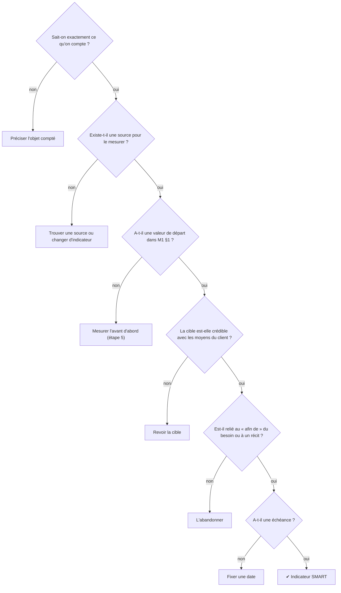

# Étape 9 — Définir les indicateurs cibles

> Phase 2 Analyser · **Mesurer** · Artefact : [M1 Situation de départ et indicateurs](../modeles/M1-indicateurs.md), §2 et §3 · Jalon **J2** · ⏱ 45 min

## Pourquoi cette étape ?

À la fin, le client demandera : « Est-ce que ça a marché ? ». Si vous ne fixez pas **maintenant**, avant de choisir la solution, ce que « marcher » veut dire, vous serez tentés de choisir les indicateurs qui arrangent la solution retenue.

## Ce dont vous avez besoin

- [M1](../modeles/M1-indicateurs.md) §1 (les valeurs de départ, [étape 5](E05-chiffrer-situation-depart.md)).
- [C4](../modeles/C4-fiche-besoins.md) : l'énoncé du besoin (son « afin de ») et les récits Must.

## Comment faire, pas à pas

1. **Partez du « afin de »** de l'énoncé du besoin : c'est votre indicateur **d'effet** principal.
2. **Ajoutez au moins un indicateur d'usage** : la meilleure solution ne sert à rien si personne ne l'utilise (taux d'inscription, part des réservations faites dans le nouvel outil…).
3. **Vérifiez que chaque indicateur est SMART** :

   | Lettre | Question | ❌ | ✅ |
   |---|---|---|---|
   | **S**pécifique | Qu'est-ce qu'on compte exactement ? | « moins d'erreurs » | « nombre de livres prêtés alors qu'ils étaient réservés » |
   | **M**esurable | Avec quelle source ? | « satisfaction » | « note moyenne à la question 1 du sondage de décembre » |
   | **A**tteignable | Est-ce crédible avec les moyens du client ? | « 0 retard » | « moins de 10 % de retours en retard » |
   | **R**éaliste / pertinent | Est-ce lié au problème ? | « nombre de connexions » | « délai médian entre la réservation et la mise à disposition » |
   | **T**emporel | Pour quand ? | — | « à 3 mois de la mise en service » |

4. **Pour chaque indicateur**, remplissez : départ (repris de M1 §1), cible, échéance, **qui** le mesure et **comment**.
5. **§3 Collecte** : vérifiez que la mesure ne demande pas un effort démesuré au client. L'idéal : un indicateur que la solution produit d'elle-même (statistiques, export).

## 🗺️ En schéma

### Mon indicateur est-il SMART ?

> Tous les schémas : [diagrammes UML](schemas-uml.md) · [arbres de décision](arbres-de-decision.md)

## Exemple

[M1 du club de handball, §2 et §3](../exemples/hbc-val-de-furan/M1-indicateurs.md) : 5 indicateurs, dont 2 d'usage et 3 d'effet, relevés en 10 minutes par mois.

## Pièges à éviter

- Un indicateur sans valeur de départ : on ne pourra rien comparer.
- Uniquement des indicateurs de satisfaction : utiles, mais subjectifs.
- Des cibles tirées d'un chapeau : justifiez-les (un exemple du secteur, un calcul, l'avis du client).

## J'ai fini quand…

- [ ] 3 à 6 indicateurs, chacun avec départ, cible, échéance, méthode ;
- [ ] au moins un indicateur d'usage et un d'effet ;
- [ ] la collecte est réaliste pour le client.

---
[← Étape 8](E08-recits-gherkin-moscow.md) · [Parcours](../METHODE.md) · [Étape 10 — Coter les besoins DICP →](E06-donnees-et-dicp.md#étape-10--cotation-dicp-2) · puis [Étape 11 — Rechercher des solutions →](E11-rechercher-solutions.md)
