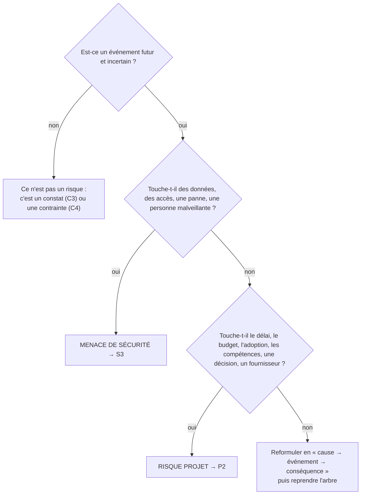
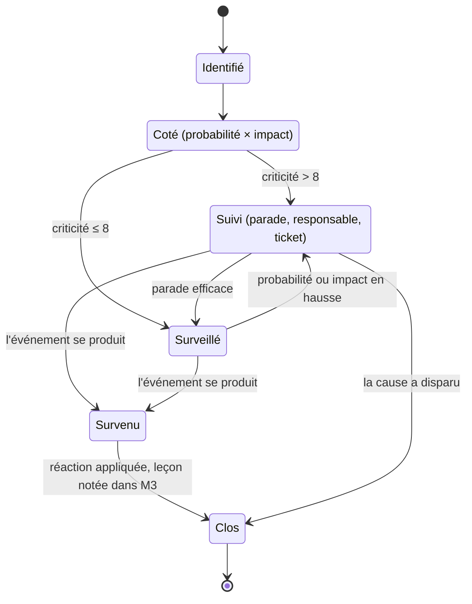

# Étape 14 — Ouvrir le registre des risques projet

> Phase 3 Faisabilité · **Piloter** · Artefact : [P2 Registre des risques](../modeles/P2-registre-risques.md) · ouvert à **J2**, tenu jusqu'à **J4** · ⏱ 45 min puis 5 min par séance

## Pourquoi cette étape ?

Un risque, c'est un problème qui ne s'est **pas encore** produit. Le repérer tôt coûte quelques minutes ; le subir coûte le projet. Le registre vous oblige à prévoir une parade et un responsable, et montre au client que vous avez réfléchi à ce qui peut mal tourner.

Ne confondez pas : **P2** = risques du **projet** (délai, budget, adoption, compétences, dépendance à une personne). **S3** = risques de **sécurité** (données, accès, pannes).

## Ce dont vous avez besoin

- [C5](../modeles/C5-etude-faisabilite.md) §4 (risques par scénario).
- [C1](../modeles/C1-parties-prenantes.md) : les craintes des parties prenantes sont des sources de risque.
- Le modèle de ticket **Risque** du dépôt.

## Comment faire, pas à pas

1. **Copiez le modèle** : `cp modeles/P2-registre-risques.md livrables/`.
2. **Trouvez les risques** en parcourant ces familles :

   | Famille | Question |
   |---|---|
   | Adoption | Les utilisateurs réels vont-ils changer leurs habitudes ? Qui risque d'être exclu ? |
   | Personnes | Le projet dépend-il d'une seule personne (qui part, qui est débordée) ? |
   | Décision | Le décideur peut-il changer d'avis ? Un vote, un conseil, un financement est-il nécessaire ? |
   | Fournisseur | L'outil choisi peut-il changer de prix, fermer, mal fonctionner ? |
   | Données | La reprise de l'existant peut-elle échouer (fichiers sales, doublons) ? |
   | Calendrier | Quelle date ne peut pas bouger ? Qu'est-ce qui peut la faire glisser ? |

3. **Rédigez chaque risque en « cause → événement → conséquence »** : « La seule personne qui sait administrer l'outil change de poste → plus personne ne crée les comptes des nouveaux arrivants → ils reviennent à l'ancienne méthode ».
4. **Cotez** probabilité (1-4) × impact (1-4) = criticité. Au-dessus de 8 : parade **obligatoire** et **ticket** GitHub (étiquette `risque`).
5. **Parade** : *prévention* (ce qu'on fait pour que ça n'arrive pas) et/ou *réaction* (ce qu'on fera si ça arrive). Un **responsable** nommé, côté client ou côté équipe.
6. **À chaque séance** (5 min, animateur) : un risque s'est-il produit ? Sa probabilité a-t-elle changé ? Notez-le dans le tableau « Évolution ». L'historique Git doit montrer que le registre **vit**.

## 🗺️ En schéma

### Risque projet (P2) ou menace de sécurité (S3) ?

Un même problème peut avoir les deux faces (ex. « le seul administrateur part ») : une ligne dans P2 et une dans S3, avec un renvoi.

### Diagramme d'états-transitions — la vie d'un risque (P2)

> Tous les schémas : [diagrammes UML](schemas-uml.md) · [arbres de décision](arbres-de-decision.md)

## Exemple

[P2 du club de handball](../exemples/hbc-val-de-furan/P2-registre-risques.md) : 6 risques, dont 2 d'adoption ; un risque clos après un import test ; une probabilité revue à la baisse.

## Pièges à éviter

- Des risques génériques (« retard », « bug ») : pas de parade possible.
- Un registre rempli à J2 et plus jamais touché.
- Oublier les risques d'adoption : ce sont les plus fréquents.

## J'ai fini quand…

- [ ] au moins 6 risques, dont 2 liés à l'adoption ;
- [ ] chaque risque en « cause → événement → conséquence » ;
- [ ] criticité > 8 → parade, responsable, ticket ;
- [ ] une ligne « Évolution » par séance à partir de J2.

---
[← Étape 13](E13-rgpd.md) · [Parcours](../METHODE.md) · [Étape 15 — Présenter la recommandation (J2) →](E15-presenter-go-no-go.md)
