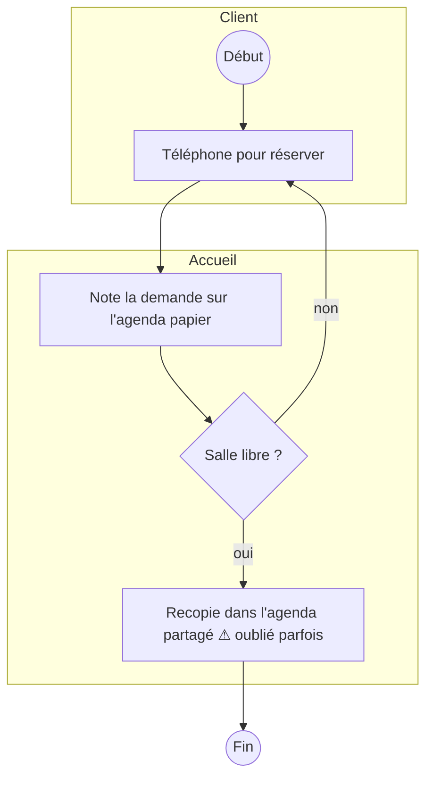
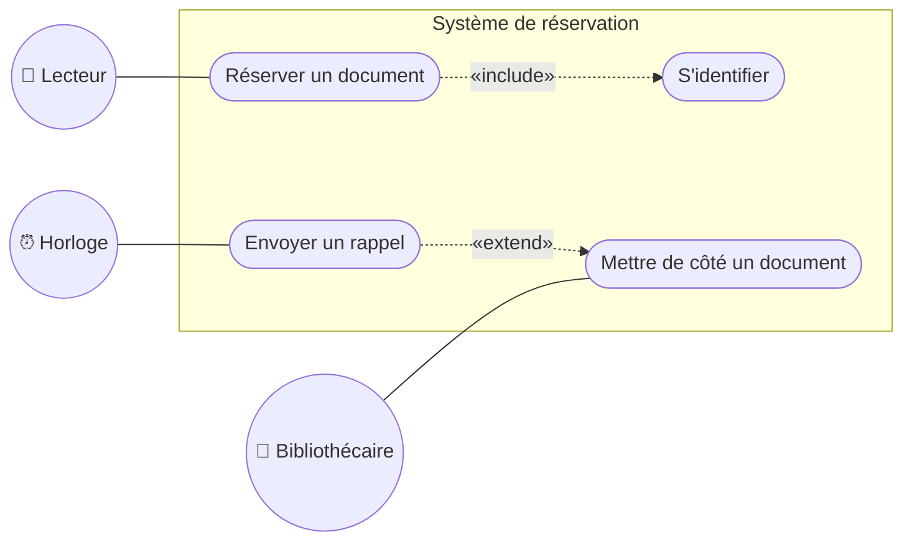
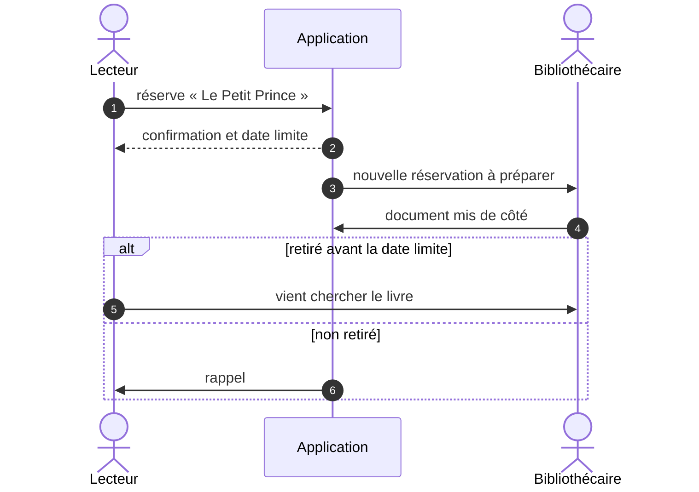
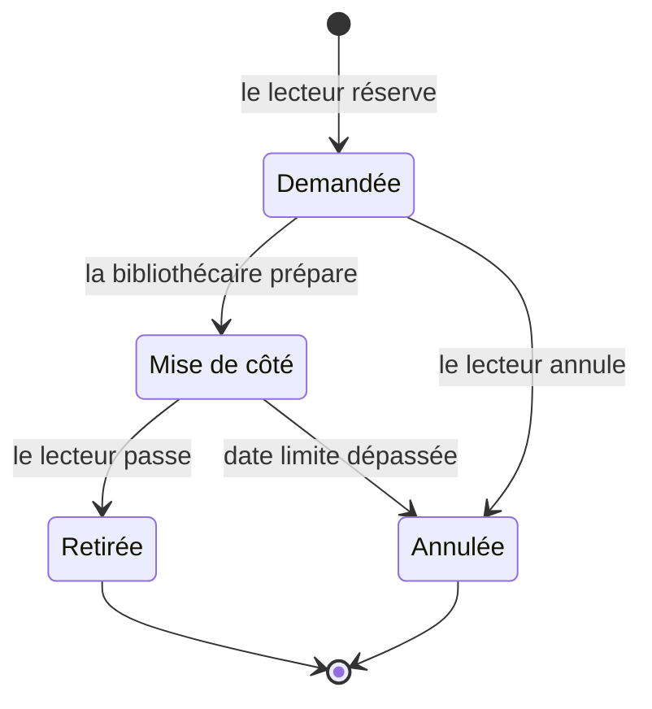
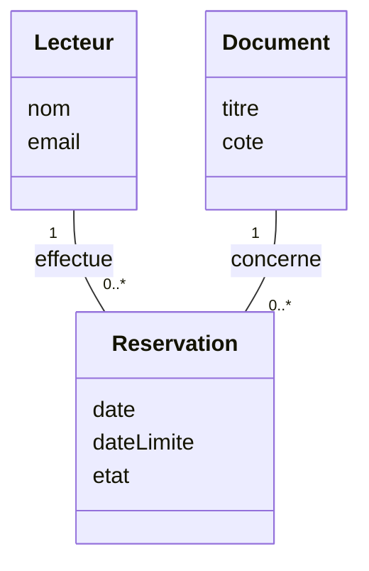

# Aide-mémoire — dessiner ses diagrammes UML en Mermaid

> Dans vos artefacts, les diagrammes s'écrivent **en texte**, dans un bloc ` ```mermaid `. GitHub les dessine automatiquement dans l'aperçu du fichier.
> Avantage : ils sont versionnés comme le reste, on voit qui a modifié quoi, et on les corrige sans logiciel de dessin.

## Quel diagramme, pour quoi, dans quel artefact ?

| Diagramme UML | Il répond à la question… | Artefact | Étape |
|---|---|---|---|
| **Activité** (processus actuel) | *Comment ça se passe aujourd'hui, qui fait quoi, où ça coince ?* | [C4](../modeles/C4-fiche-besoins.md) §1 bis | [7](E07-reformuler-le-besoin.md) |
| **Cas d'utilisation** | *Qui utilisera la solution, et pour faire quoi ?* | [C4](../modeles/C4-fiche-besoins.md) §4 bis | [8](E08-recits-gherkin-moscow.md) |
| **Activité** (processus cible) | *Comment ça se passera avec la solution retenue ?* | [C6](../modeles/C6-dossier-solution.md) §3 bis | [16](E16-dossier-solution.md) |
| **Séquence** | *Dans quel ordre les acteurs et la solution échangent-ils, pour le scénario principal ?* | [C6](../modeles/C6-dossier-solution.md) §3 ter | [16](E16-dossier-solution.md) |
| **États-transitions** *(facultatif)* | *Par quels états passe un objet clé : réservation, candidature, devis… ?* | [C6](../modeles/C6-dossier-solution.md) §3 quater | [16](E16-dossier-solution.md) |
| **Classes** *(si développement sur mesure)* | *Quelles informations la solution manipule-t-elle, et comment sont-elles reliées ?* | [C6](../modeles/C6-dossier-solution.md) §3 quater | [16](E16-dossier-solution.md) |

Des exemples complets sont dans le mini-cas du club de handball : [C4](../exemples/hbc-val-de-furan/C4-fiche-besoins.md) (activité actuelle, cas d'utilisation) et [C6](../exemples/hbc-val-de-furan/C6-dossier-solution.md) (activité cible, séquence, états).

## Méthode en 4 temps

1. **Au brouillon d'abord** (papier, tableau blanc) : on se met d'accord sur le contenu avant la syntaxe.
2. **Partez d'un gabarit** ci-dessous, copiez-le dans votre artefact, remplacez les libellés.
3. **Testez** dans l'éditeur en ligne [mermaid.live](https://mermaid.live) : il affiche l'erreur exacte si la syntaxe est fausse.
4. **Vérifiez sur GitHub** : ouvrez le fichier après le push, onglet *Preview*.

**Règles qui évitent 90 % des erreurs**
- Mettez **tous les libellés entre guillemets** : `A["Envoie la convocation (jeudi)"]`. Sans guillemets, les parenthèses, `?`, `:` ou `«»` cassent le diagramme.
- N'utilisez **pas de guillemets droits `"` à l'intérieur** d'un libellé : prenez « ».
- Identifiants de nœuds **courts et sans accent** (`e1`, `parent`, `uc3`) ; les accents vont dans les libellés.
- Dans les diagrammes de séquence et d'états, **évitez le point-virgule** dans les textes.
- Un retour à la ligne dans un libellé : `<br/>`.

---

## 1. Diagramme d'activité (avec couloirs par acteur)

Chaque couloir (`subgraph`) est un acteur. Rectangle = activité, losange = décision, cercle = début / fin.

````markdown

````

💡 Marquez d'un **⚠** ou d'un **⏱** les endroits où l'information se perd ou attend : ce sont vos constats C3, et ce sont eux que la solution doit supprimer.

## 2. Diagramme de cas d'utilisation

Mermaid n'a pas de diagramme de cas d'utilisation « officiel » ; on le dessine ainsi : **acteurs** = cercles `(( ))`, **cas** = ovales `([ ])` à l'intérieur du **système** (`subgraph`), relations `«include»` / `«extend»` en pointillé.

````markdown

````

- `«include»` : le cas A **contient toujours** le cas B (réserver ⇒ s'identifier).
- `«extend»` : le cas B **s'ajoute parfois** au cas A, sous condition (rappel si pas de retrait).
- Un acteur peut être une **personne**, un **autre système** (logiciel fédéral, base régionale) ou le **temps** (tâche automatique).

## 3. Diagramme de séquence

````markdown

````

`->>` message, `-->>` réponse, `actor` pour une personne, `participant` pour un système. Blocs : `alt … else … end` (choix), `opt … end` (facultatif), `loop … end` (répétition), `Note over X: …`.

## 4. Diagramme d'états-transitions

````markdown

````

Déclarez les états avec `state "Libellé" as Code`, puis les transitions `Code1 --> Code2 : événement`.

## 5. Diagramme de classes (si vous proposez un développement)

````markdown

````

Multiplicités : `1` (exactement un), `0..1`, `0..*`, `1..*`. Noms de classes **sans accent ni espace**.

---

Voir aussi : [les diagrammes UML de la méthode](schemas-uml.md) · [les arbres de décision](arbres-de-decision.md) · [parcours](../METHODE.md)
