# Arbres de décision

> Un arbre de décision se lit **de haut en bas** : on répond à la question du losange, on suit la flèche « oui » ou « non », jusqu'à une case qui dit quoi faire.
> Ils ne remplacent pas votre réflexion : ils vous évitent d'oublier une question. **Notez dans l'artefact la réponse à chaque question**, c'est ce qui justifie votre choix.

| Arbre | Quand l'utiliser | Fiche |
|---|---|---|
| [Où en sommes-nous ? Quelle étape maintenant ?](#orientation) | Se repérer | [METHODE](../METHODE.md) |
| [Classer une phrase du besoin exprimé](#classer_phrase) | Phase 1 — Recueillir | [E01-lire-le-besoin-exprime](E01-lire-le-besoin-exprime.md) |
| [Ma question d'entretien est-elle bonne ?](#question_entretien) | Phase 1 — Recueillir | [E03-preparer-entretien](E03-preparer-entretien.md) |
| [Quel niveau de certitude pour un constat (C3 §2) ?](#certitude) | Phase 1 — Recueillir | [E04-mener-entretien-compte-rendu](E04-mener-entretien-compte-rendu.md) |
| [Cette donnée est-elle personnelle ? sensible ?](#donnee) | Phase 1 — Recueillir | [E06-donnees-et-dicp](E06-donnees-et-dicp.md) |
| [Must, Should, Could ou Won't ?](#moscow) | Phase 2 — Analyser | [E08-recits-gherkin-moscow](E08-recits-gherkin-moscow.md) |
| [Mon indicateur est-il SMART ?](#smart) | Phase 2 — Analyser | [E09-indicateurs](E09-indicateurs.md) |
| [Une IA est-elle la bonne réponse ?](#ia) | Phase 3 — Faisabilité | [E11-rechercher-solutions](E11-rechercher-solutions.md) |
| [Quel scénario recommander ? GO ou NO-GO ?](#scenario) | Phase 3 — Faisabilité | [E12-faisabilite-telos-couts](E12-faisabilite-telos-couts.md) |
| [Quelle base légale pour le traitement ?](#base_legale) | Phase 3 — Faisabilité | [E13-rgpd](E13-rgpd.md) |
| [Faut-il une analyse d'impact (AIPD) ?](#aipd) | Phase 3 — Faisabilité | [E13-rgpd](E13-rgpd.md) |
| [Risque projet (P2) ou menace de sécurité (S3) ?](#p2_s3) | Phase 3 — Faisabilité | [E14-risques-projet](E14-risques-projet.md) |
| [Quelle stratégie de bascule ?](#bascule) | Phase 4 — Préparer la mise en place | [E18-deploiement](E18-deploiement.md) |

---

## Se repérer

### Où en sommes-nous ? Quelle étape maintenant ?

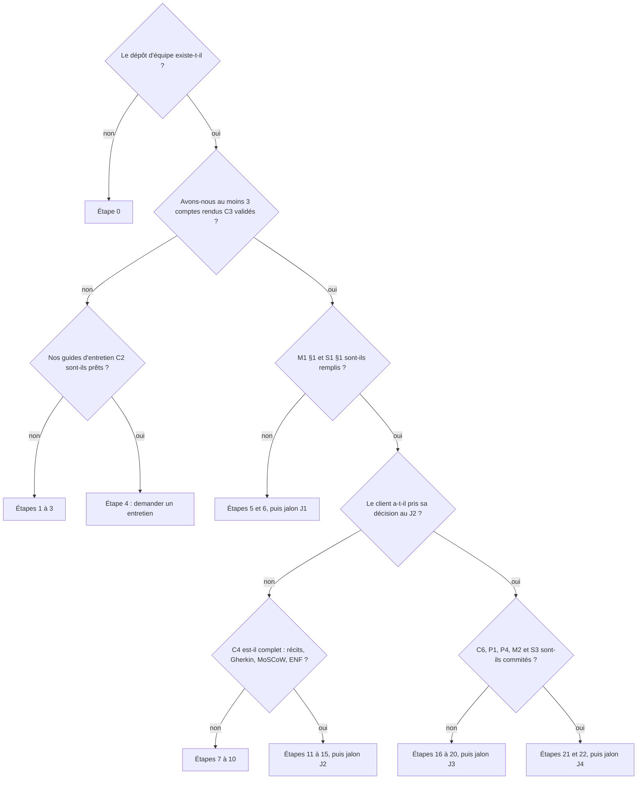

À relire au début de chaque séance.

*Fiche associée : [METHODE](../METHODE.md).*

---

## Phase 1 — Recueillir

### Classer une phrase du besoin exprimé

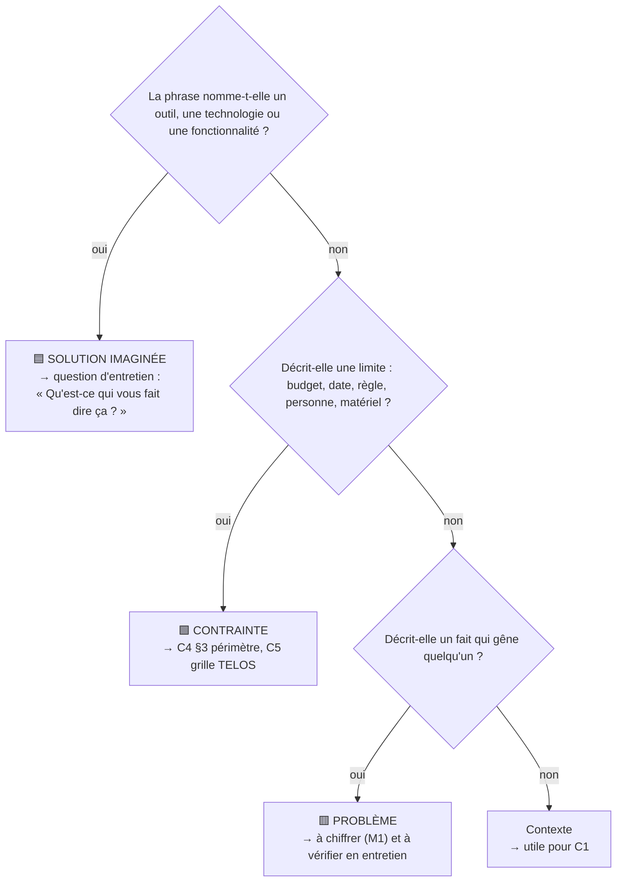

*Fiche associée : [E01-lire-le-besoin-exprime](E01-lire-le-besoin-exprime.md).*

### Ma question d'entretien est-elle bonne ?

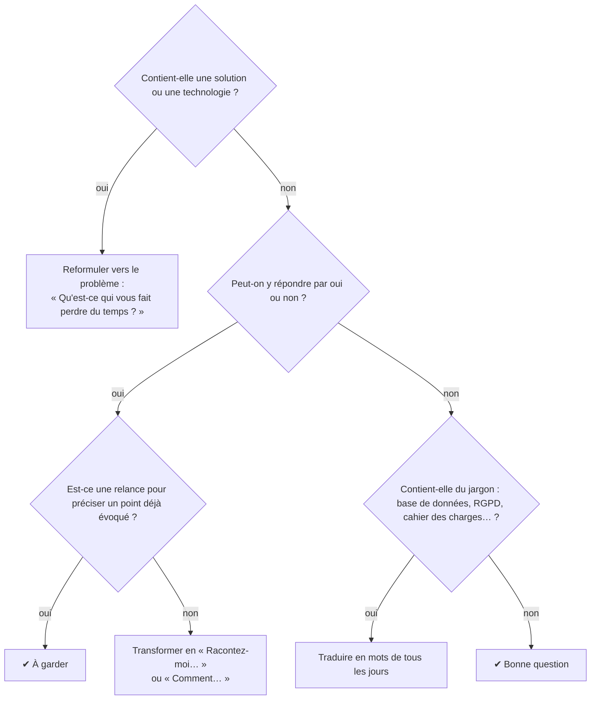

*Fiche associée : [E03-preparer-entretien](E03-preparer-entretien.md).*

### Quel niveau de certitude pour un constat (C3 §2) ?

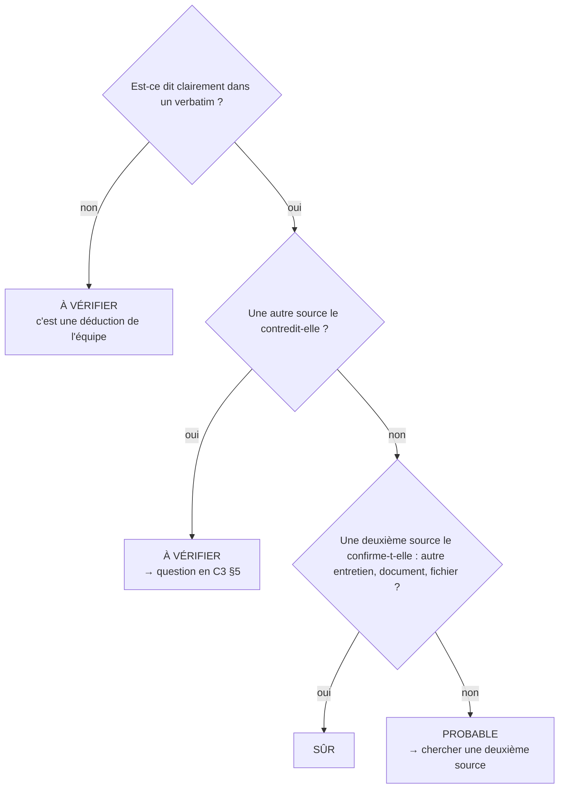

*Fiche associée : [E04-mener-entretien-compte-rendu](E04-mener-entretien-compte-rendu.md).*

### Cette donnée est-elle personnelle ? sensible ?

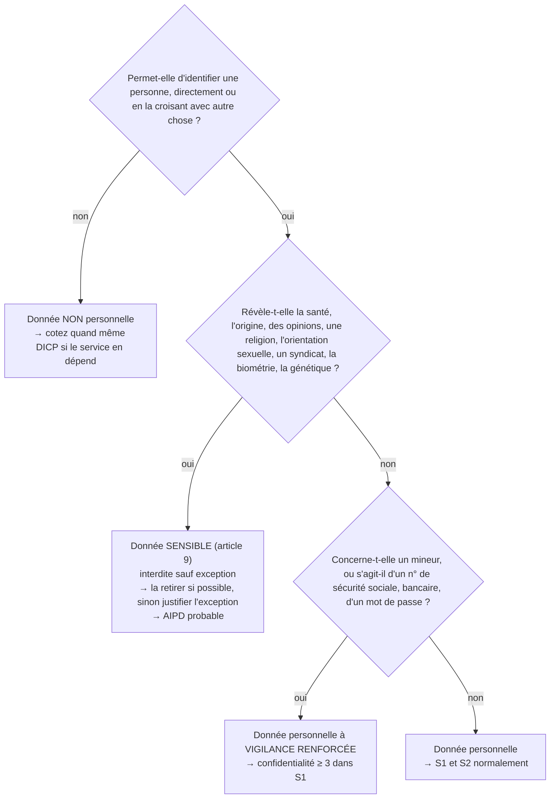

*Fiche associée : [E06-donnees-et-dicp](E06-donnees-et-dicp.md).*

---

## Phase 2 — Analyser

### Must, Should, Could ou Won't ?

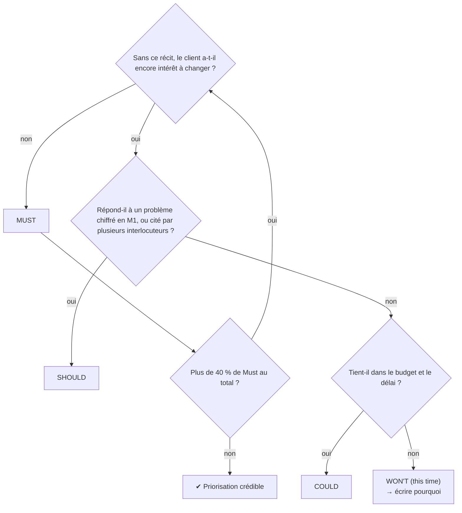

Si vous avez trop de Must, repassez chaque Must dans l'arbre en étant plus sévères.

*Fiche associée : [E08-recits-gherkin-moscow](E08-recits-gherkin-moscow.md).*

### Mon indicateur est-il SMART ?

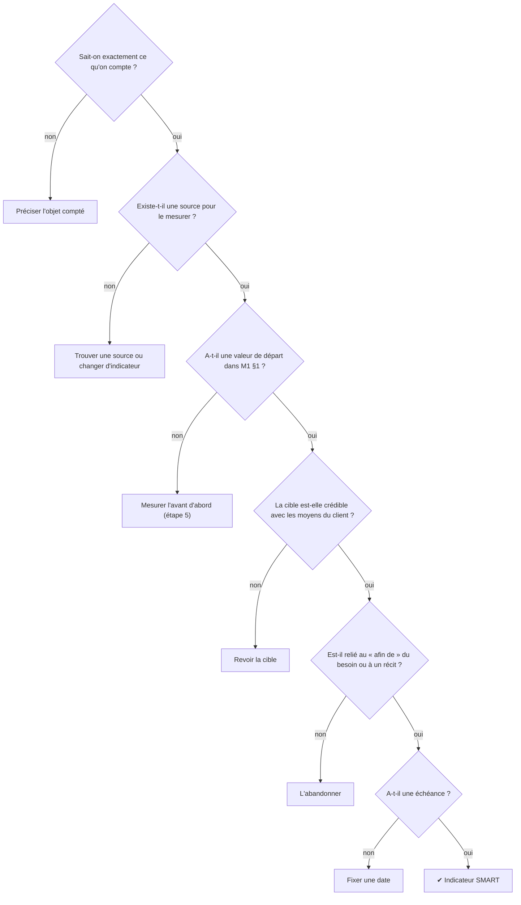

*Fiche associée : [E09-indicateurs](E09-indicateurs.md).*

---

## Phase 3 — Faisabilité

### Une IA est-elle la bonne réponse ?

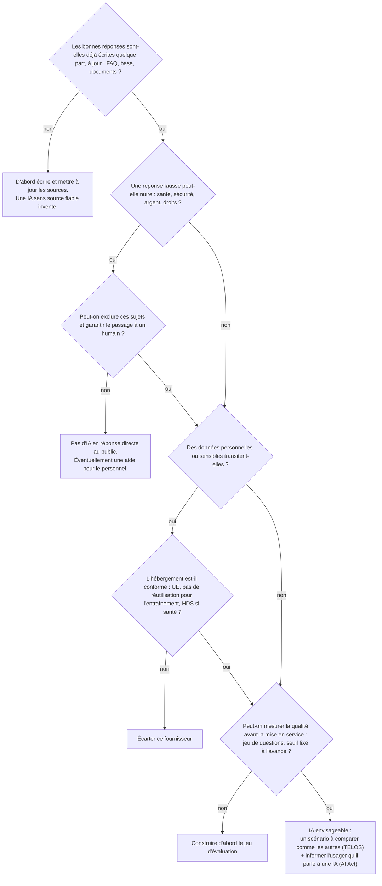

*Fiche associée : [E11-rechercher-solutions](E11-rechercher-solutions.md).*

### Quel scénario recommander ? GO ou NO-GO ?

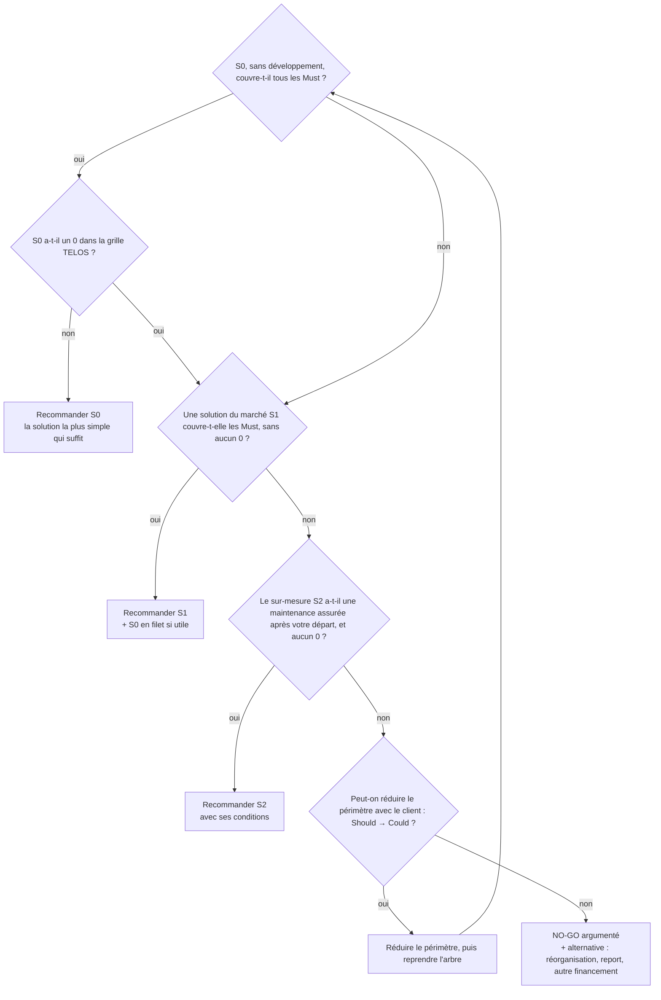

Si plusieurs scénarios passent, départagez-les par : nombre de Must couverts, total TELOS, coût sur 3 ans, risques (P2).

*Fiche associée : [E12-faisabilite-telos-couts](E12-faisabilite-telos-couts.md).*

### Quelle base légale pour le traitement ?

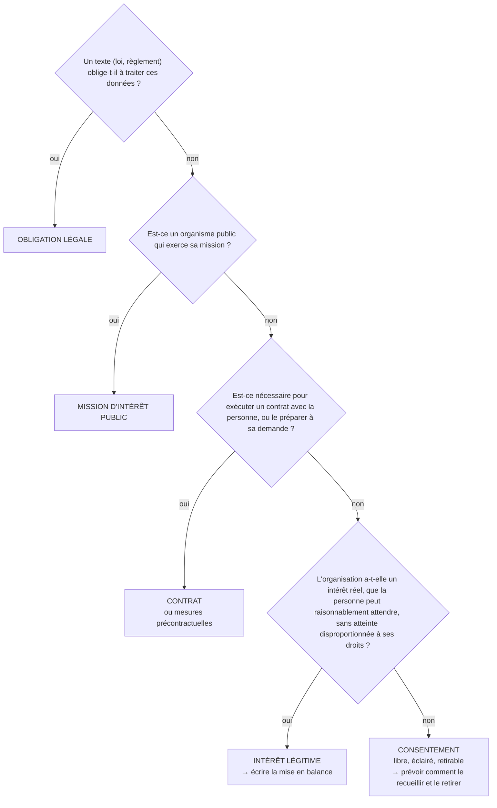

La sixième base, la sauvegarde des intérêts vitaux (urgence médicale…), est très rare dans nos cas.

*Fiche associée : [E13-rgpd](E13-rgpd.md).*

### Faut-il une analyse d'impact (AIPD) ?

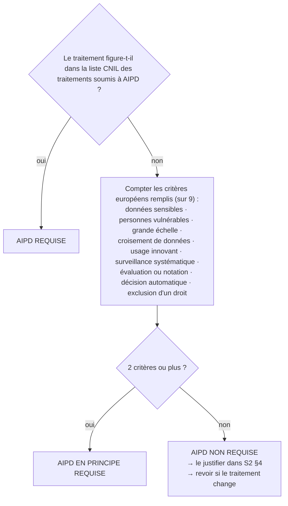

*Fiche associée : [E13-rgpd](E13-rgpd.md).*

### Risque projet (P2) ou menace de sécurité (S3) ?

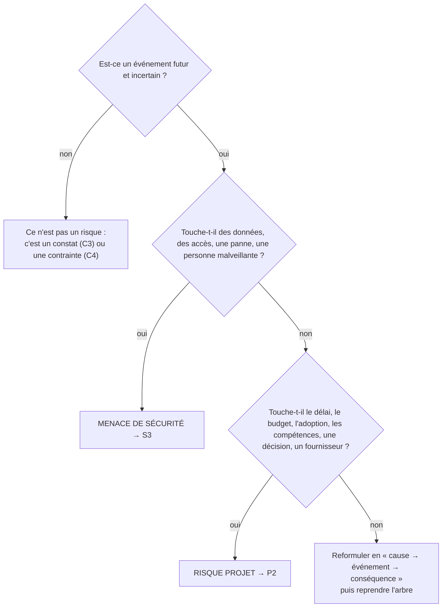

Un même problème peut avoir les deux faces (ex. « le seul administrateur part ») : une ligne dans P2 et une dans S3, avec un renvoi.

*Fiche associée : [E14-risques-projet](E14-risques-projet.md).*

---

## Phase 4 — Préparer la mise en place

### Quelle stratégie de bascule ?

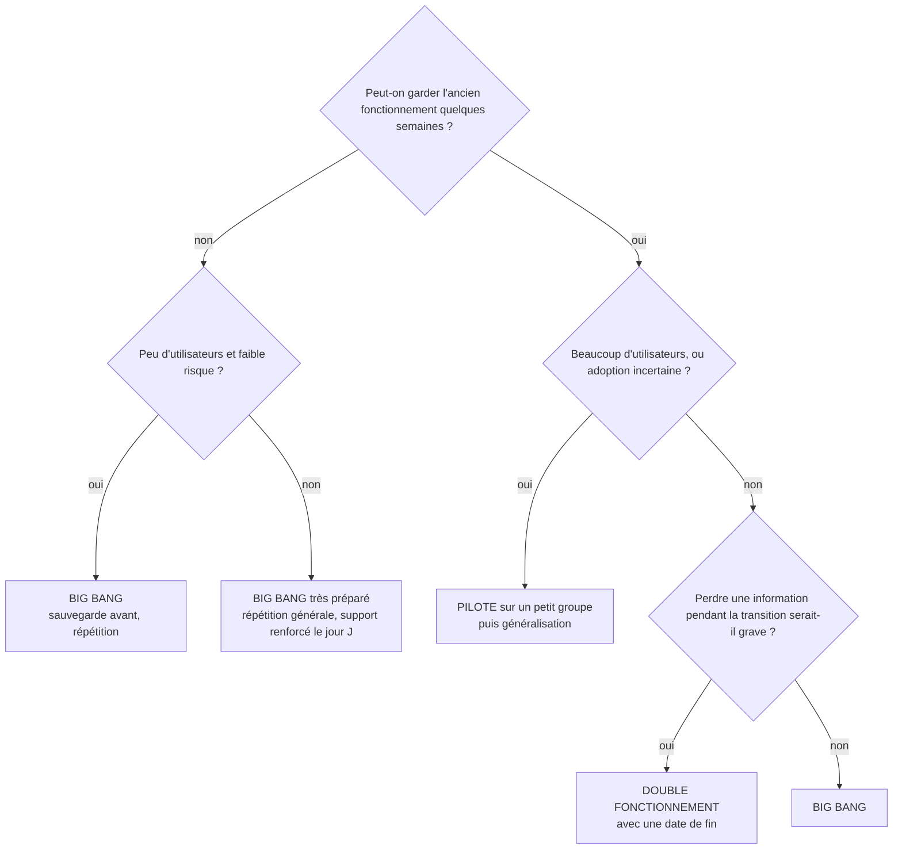

Dans tous les cas : un critère de retour arrière chiffré (P4 §1).

*Fiche associée : [E18-deploiement](E18-deploiement.md).*

---
[Parcours](../METHODE.md) · [Diagrammes UML](schemas-uml.md) · [Aide-mémoire UML](aide-memoire-uml-mermaid.md)
