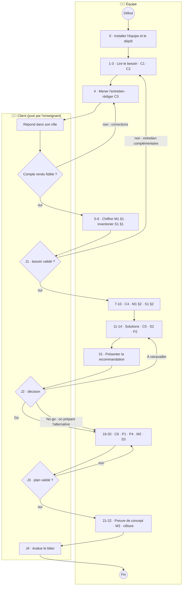
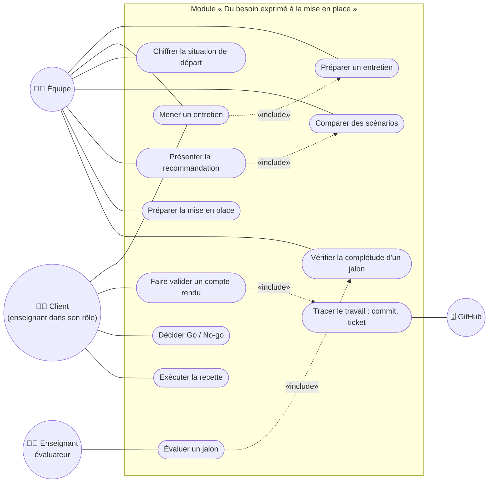
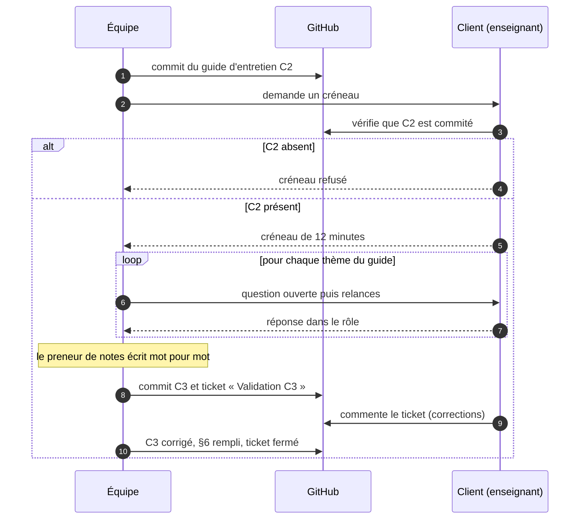
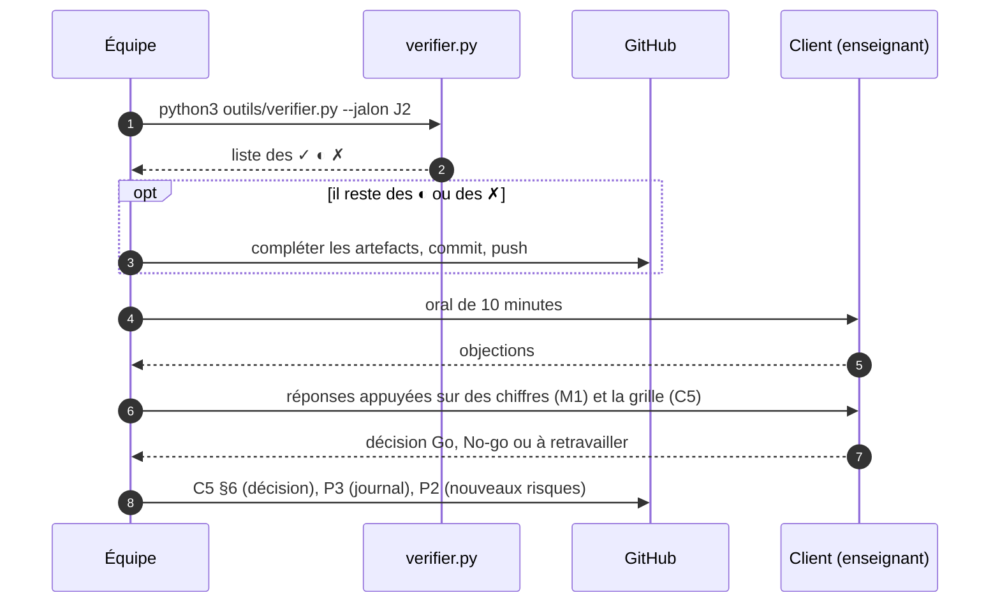
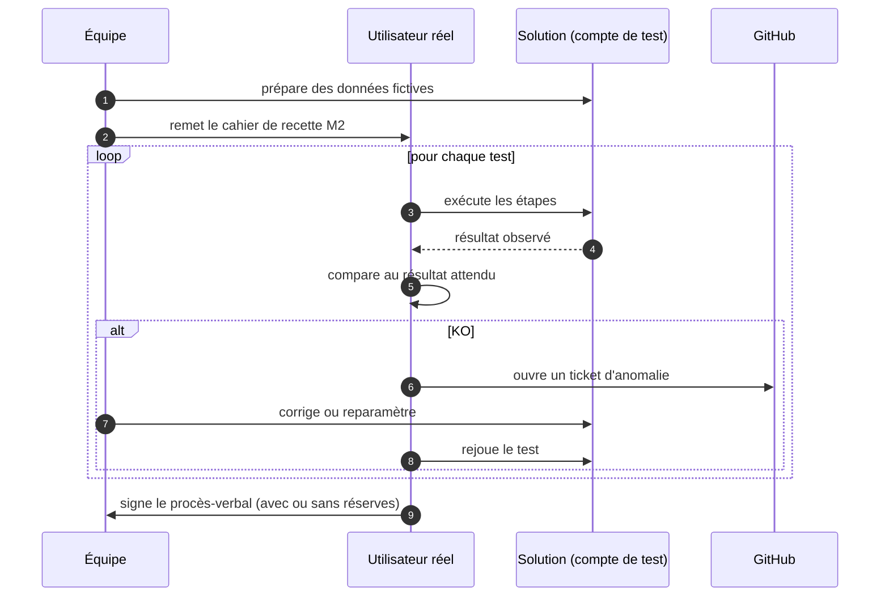
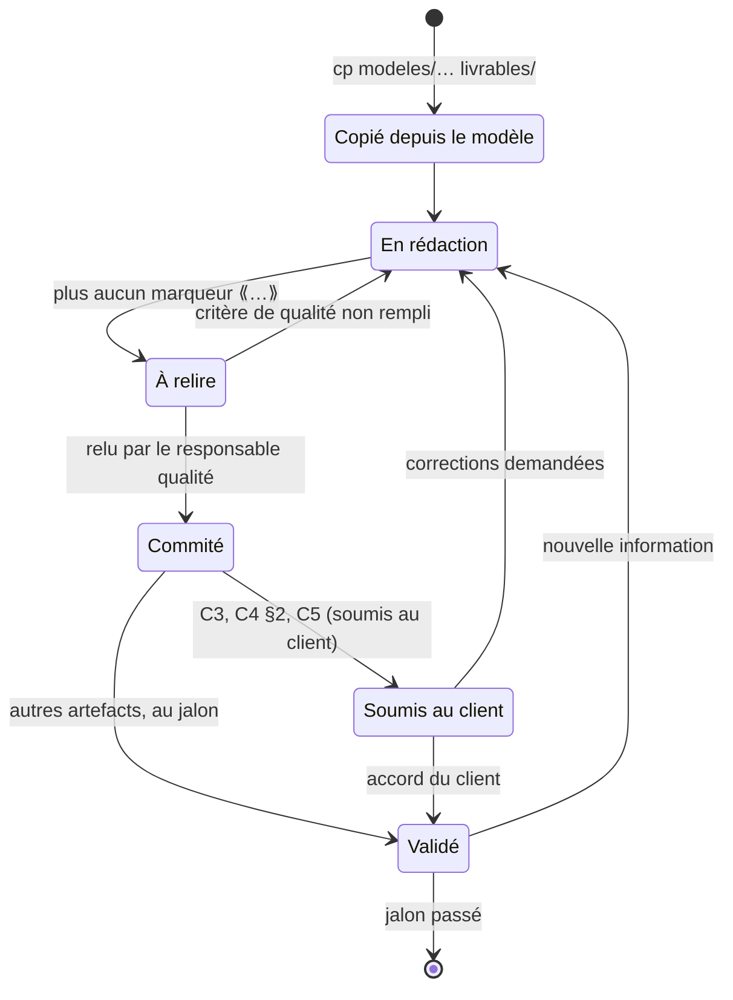
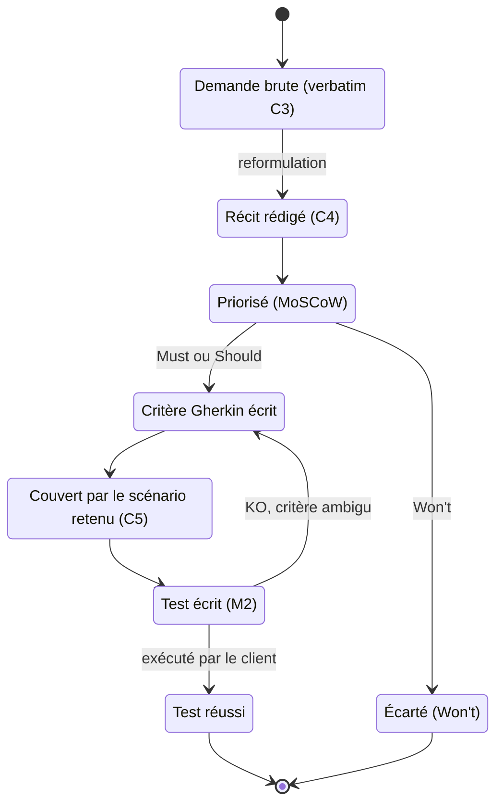
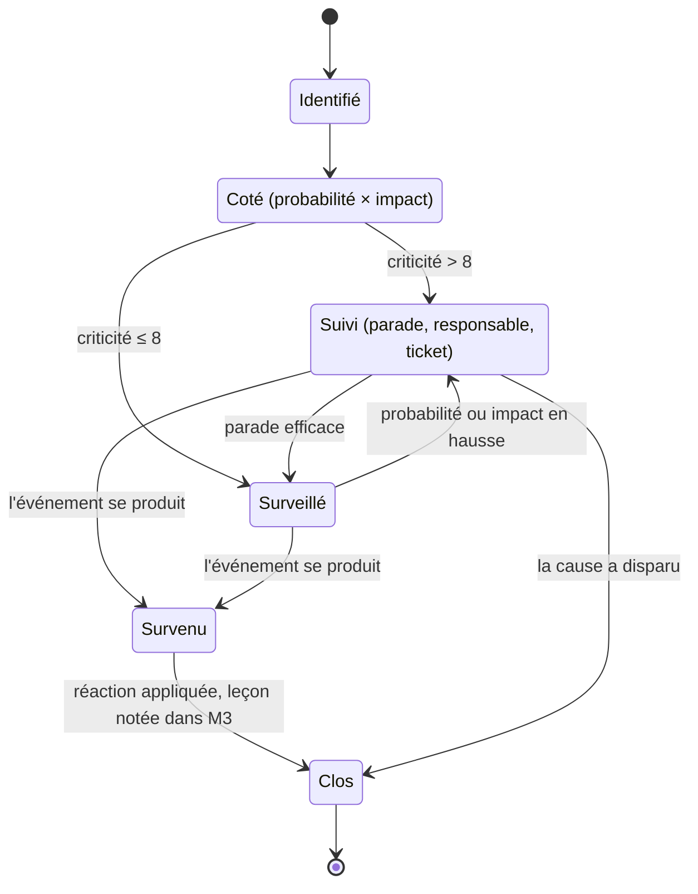
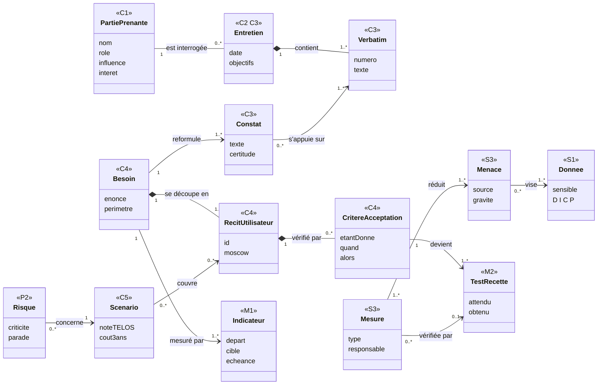

# La méthode en diagrammes UML

> Ces diagrammes décrivent **la méthode elle-même** : qui fait quoi, dans quel ordre, comment un document évolue, comment les artefacts sont reliés.
> Pour dessiner **vos propres** diagrammes (processus de votre organisation, cas d'utilisation, séquences), voir l'[aide-mémoire UML en Mermaid](aide-memoire-uml-mermaid.md).
> Pour les choix à faire en cours de route : les [arbres de décision](arbres-de-decision.md).

| Diagramme | Ce qu'il montre | Où il sert |
|---|---|---|
| Diagramme d'activité | la méthode complète, par acteur | [METHODE.md](../METHODE.md) |
| Diagramme de cas d'utilisation | qui fait quoi dans le module | [METHODE.md](../METHODE.md) |
| Diagramme de séquence | de l'entretien au compte rendu validé (étapes 3-4) | [étape 4](E04-mener-entretien-compte-rendu.md) |
| Diagramme de séquence | le passage d'un jalon avec oral (J2) | [étape 15](E15-presenter-go-no-go.md) |
| Diagramme de séquence | l'exécution de la recette (étape 19) | [étape 19](E19-recette.md) |
| Diagramme d'états-transitions | la vie d'un artefact | [étape 0](E00-installer-equipe-et-depot.md) |
| Diagramme d'états-transitions | d'une phrase du client à un test réussi | [étape 8](E08-recits-gherkin-moscow.md) |
| Diagramme d'états-transitions | la vie d'un risque (P2) | [étape 14](E14-risques-projet.md) |
| Diagramme de classes | comment les artefacts s'enchaînent (traçabilité) | [étape 7](E07-reformuler-le-besoin.md), [METHODE §4](../METHODE.md#4-carte-des-16-artefacts) |

---

## Le processus global

### Diagramme d'activité — la méthode complète, par acteur

Chaque rectangle est une activité de l'équipe, chaque losange une décision du client. Les flèches qui remontent montrent qu'on **revient en arrière** quand le client n'est pas d'accord : c'est normal, c'est prévu.

*Utilisé à : [METHODE.md](../METHODE.md).*

---

## Les acteurs et leurs usages (diagramme de cas d'utilisation)

### Diagramme de cas d'utilisation — qui fait quoi dans le module

Un bonhomme (cercle) est un **acteur** : une personne ou un système extérieur. Un ovale est un **cas d'utilisation** : un service rendu, formulé par un verbe. La flèche pointillée `«include»` signifie « contient toujours » : on ne mène pas d'entretien sans l'avoir préparé.

*Utilisé à : [METHODE.md](../METHODE.md). Pour dessiner les cas d'utilisation de votre organisation : [aide-mémoire §2 et §2 bis](aide-memoire-uml-mermaid.md#2-diagramme-de-cas-dutilisation).*

---

## Les interactions (diagrammes de séquence)

### Diagramme de séquence — de l'entretien au compte rendu validé (étapes 3-4)

Lisez de haut en bas : chaque flèche est un message, dans l'ordre (numéros). Le bloc `alt` montre deux cas possibles, le bloc `loop` une répétition.

*Utilisé à : [étape 4](E04-mener-entretien-compte-rendu.md).*

### Diagramme de séquence — le passage d'un jalon avec oral (J2)

Le bloc `opt` est facultatif : il n'a lieu que si la condition est vraie.

*Utilisé à : [étape 15](E15-presenter-go-no-go.md).*

### Diagramme de séquence — l'exécution de la recette (étape 19)

C'est l'**utilisateur réel** qui exécute, pas l'équipe : c'est tout l'intérêt de la recette.

*Utilisé à : [étape 19](E19-recette.md).*

---

## Les cycles de vie (diagrammes d'états-transitions)

### Diagramme d'états-transitions — la vie d'un artefact

Un rectangle arrondi est un **état**, une flèche une **transition**, le texte après « : » l'événement qui la déclenche. Un artefact peut revenir en rédaction à tout moment si une information nouvelle arrive.

*Utilisé à : [étape 0](E00-installer-equipe-et-depot.md).*

### Diagramme d'états-transitions — d'une phrase du client à un test réussi

Ce diagramme montre la **traçabilité** : chaque test de recette doit pouvoir remonter jusqu'à une phrase prononcée par le client.

*Utilisé à : [étape 8](E08-recits-gherkin-moscow.md).*

### Diagramme d'états-transitions — la vie d'un risque (P2)

*Utilisé à : [étape 14](E14-risques-projet.md).*

---

## Les liens entre artefacts (diagramme de classes)

### Diagramme de classes — comment les artefacts s'enchaînent (traçabilité)

Chaque classe est une notion de la méthode ; l'étiquette `<<C3>>` indique dans quel artefact on la trouve. Les multiplicités (`1`, `0..*`, `1..*`) se lisent : « un besoin se découpe en **un ou plusieurs** récits ». Le losange plein (composition) signifie que l'élément n'existe pas sans son parent.

*Utilisé à : [étape 7](E07-reformuler-le-besoin.md), [METHODE §4](../METHODE.md#4-carte-des-16-artefacts).*

---
[Parcours](../METHODE.md) · [Arbres de décision](arbres-de-decision.md) · [Aide-mémoire UML](aide-memoire-uml-mermaid.md)
