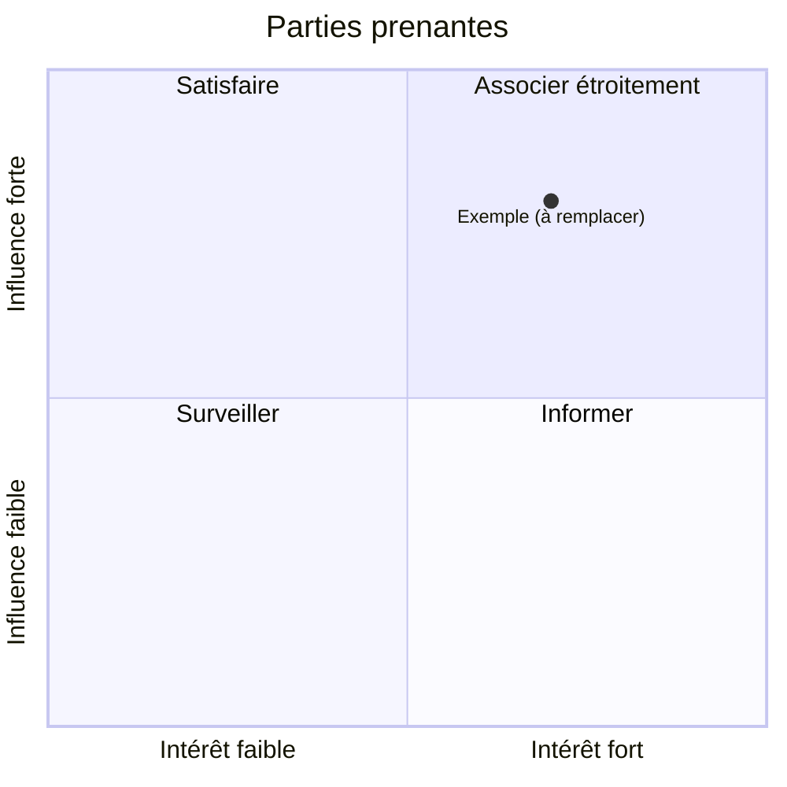

# C1 — Carte des parties prenantes

> **Concevoir** · Phase 1 Recueillir · à rendre pour **J1**
>
> Cas : ⟪À COMPLÉTER : nom du cas⟫ · Équipe : ⟪À COMPLÉTER⟫
>
> 📖 Comment faire : [Étape 2](../guide/E02-parties-prenantes.md) · 🧩 Exemple rédigé : [C1](../exemples/hbc-val-de-furan/C1-parties-prenantes.md) · 📂 S'appuie sur : `README.md` et `besoin-exprime.md` de votre cas, notes de l'étape 1

## 1. Qui est concerné ?

| Partie prenante | Rôle dans l'organisation | Ce qu'elle attend | Ce qu'elle craint | Influence (1-3) | Intérêt (1-3) | Interrogée ? |
|---|---|---|---|---|---|---|
| ⟪À COMPLÉTER⟫ | | | | | | oui / non / à planifier |

Pensez aux personnes **absentes** de l'expression du besoin : celles qui subiront le changement sans l'avoir demandé, les partenaires extérieurs, les autorités (CNIL, administration…).

## 2. Matrice influence / intérêt

## 3. Qui décide, qui paie, qui utilise ?

- **Décideur** (dit oui ou non au projet) : ⟪À COMPLÉTER⟫
- **Financeur** : ⟪À COMPLÉTER⟫
- **Utilisateurs principaux** : ⟪À COMPLÉTER⟫
- **Personnes dont on traite les données** (sans être utilisatrices) : ⟪À COMPLÉTER⟫

## 4. Plan d'entretiens

| Qui | Pourquoi elle (qu'apprendra-t-on d'elle ?) | Quand | Qui mène / qui note |
|---|---|---|---|
| ⟪À COMPLÉTER⟫ | | | |

---
**Critères de qualité** — [ ] au moins une partie prenante non citée dans le besoin exprimé · [ ] décideur ≠ utilisateur identifié · [ ] chaque entretien planifié a un objectif
**Usage de l'IA** : ⟪À COMPLÉTER : ce qu'elle a produit / ce que vous avez vérifié, ou « aucun »⟫
