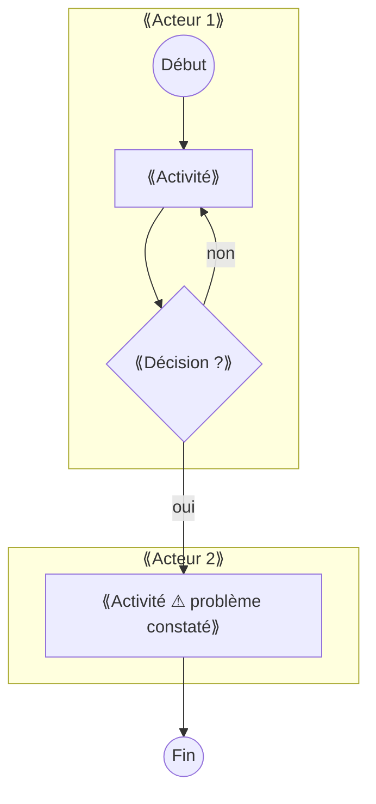
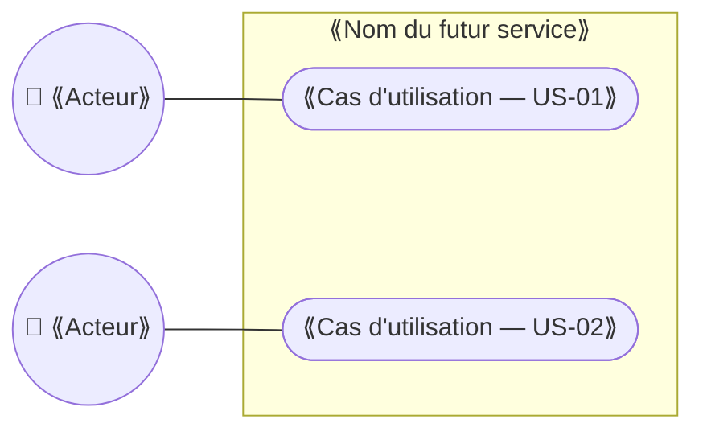

# C4 — Fiche besoins

> **Concevoir** · Phase 2 Analyser · à rendre pour **J2**
>
> 📖 Comment faire : [Étape 7](../guide/E07-reformuler-le-besoin.md) · [Étape 8](../guide/E08-recits-gherkin-moscow.md) · 🧩 Exemple rédigé : [C4](../exemples/hbc-val-de-furan/C4-fiche-besoins.md) · 📂 S'appuie sur : tous vos C3 validés, M1 §1

## 1. Le besoin exprimé, et ce qu'il cache

| Ce que le client a demandé (mot pour mot) | Le problème réel derrière | Source (C3) |
|---|---|---|
| ⟪ex. « Il nous faut une appli »⟫ | ⟪ex. les créneaux se chevauchent et personne ne le voit avant le jour J⟫ | |

## 1 bis. Le processus actuel (diagramme d'activité UML)

Dessinez **comment ça se passe aujourd'hui**, un couloir par acteur, à partir de vos C3. Marquez d'un ⚠ ou d'un ⏱ chaque endroit où l'information se perd ou attend : ce sont vos problèmes réels. Aide : [aide-mémoire UML](../guide/aide-memoire-uml-mermaid.md#1-diagramme-dactivité-avec-couloirs-par-acteur).



## 2. L'énoncé du besoin en une phrase

> **Pour** ⟪qui⟫ **qui** ⟪a tel problème⟫, **nous proposons de** ⟪résultat attendu, sans nommer de technologie⟫ **afin de** ⟪bénéfice mesurable⟫.

## 3. Périmètre

| Dans le périmètre | Hors périmètre (et pourquoi) |
|---|---|
| ⟪À COMPLÉTER⟫ | |

## 4. Récits utilisateur et critères d'acceptation

| ID | En tant que… | je veux… | afin de… | MoSCoW | Ticket GitHub |
|---|---|---|---|---|---|
| US-01 | ⟪…⟫ | | | Must | #⟪…⟫ |

Pour chaque récit **Must**, au moins un critère d'acceptation :

```gherkin
Fonctionnalité: ⟪US-01⟫
  Scénario: ⟪cas nominal⟫
    Étant donné ⟪contexte⟫
    Quand ⟪action⟫
    Alors ⟪résultat observable⟫
```

## 4 bis. Diagramme de cas d'utilisation

Qui utilisera la future solution, et pour quoi faire ? Un cas d'utilisation par récit **Must** au minimum ; les acteurs peuvent être des personnes, d'autres systèmes ou le temps (tâches automatiques). Ce diagramme ne présuppose **aucune technologie**. Aide : [aide-mémoire UML](../guide/aide-memoire-uml-mermaid.md#2-diagramme-de-cas-dutilisation).



## 4 ter. Description des cas d'utilisation

Une fiche par cas d'utilisation **Must** (au minimum). Le « système » est le **futur service**, quel qu'il soit : application, outil du marché ou simple règle d'organisation. Écrivez ce que font l'acteur et le système, **pas** comment c'est programmé. Chaque scénario alternatif et chaque exception deviendra un test de recette (M2). Aide : [aide-mémoire UML §2 bis](../guide/aide-memoire-uml-mermaid.md#2-bis-décrire-un-cas-dutilisation-fiche-textuelle).

### UC-01 — ⟪Nom du cas d'utilisation, verbe à l'infinitif⟫

- **Acteur principal** : ⟪…⟫ · **Acteurs secondaires** : ⟪…⟫
- **Récit(s) lié(s)** : ⟪US-…⟫ · **Priorité** : ⟪Must⟫
- **Objectif** : ⟪ce que l'acteur veut obtenir⟫
- **Déclencheur** : ⟪l'événement qui démarre le cas⟫
- **Préconditions** : ⟪ce qui doit être vrai avant⟫

**Scénario nominal**
1. ⟪L'acteur …⟫
2. ⟪Le système …⟫
3. ⟪…⟫

**Scénarios alternatifs**
- ⟪2a. Si …, alors …, reprise à l'étape …⟫

**Exceptions**
- ⟪Ce qui empêche d'atteindre l'objectif, et ce que fait le système⟫

- **Postconditions** : ⟪ce qui est vrai après, en cas de succès⟫
- **Données manipulées (→ S1)** : ⟪…⟫
- **Règles de gestion** : ⟪ex. délai, priorité, droit d'accès⟫

*Copiez le bloc UC-01 pour chaque cas d'utilisation Must.*

## 5. Exigences non fonctionnelles

| ID | Catégorie | Exigence (mesurable) | Justification |
|---|---|---|---|
| ENF-01 | Utilisabilité | ⟪ex. un bénévole sans formation réserve un créneau en moins de 2 minutes sur téléphone⟫ | |
| ENF-02 | Disponibilité | | |
| ENF-03 | Sécurité / RGPD | | (→ S1, S2) |
| ENF-04 | Coût d'exploitation | | |
| ENF-05 | Réversibilité | ⟪ex. export complet des données en CSV⟫ | |

## 6. Hypothèses et points non tranchés

⟪À COMPLÉTER⟫

---
**Critères de qualité** — [ ] aucune technologie nommée dans l'énoncé du besoin · [ ] ≤ 40 % des récits en Must · [ ] chaque Must a un critère Gherkin · [ ] les ENF sont chiffrées · [ ] processus actuel et cas d'utilisation dessinés · [ ] une fiche descriptive par cas d'utilisation Must
**Usage de l'IA** : ⟪À COMPLÉTER⟫
