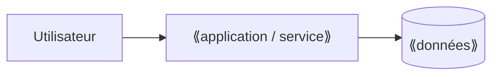
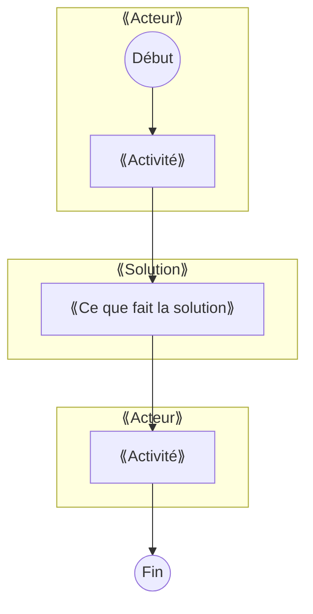
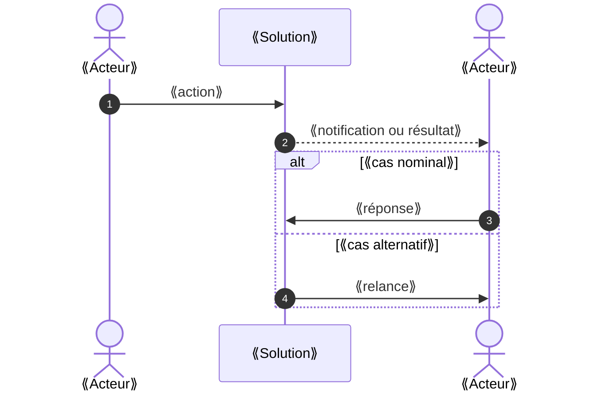

# C6 — Dossier de solution

> **Concevoir** · Phase 4 Préparer la mise en place · à rendre pour **J3**
>
> 📖 Comment faire : [Étape 16](../guide/E16-dossier-solution.md) · 🧩 Exemple rédigé : [C6](../exemples/hbc-val-de-furan/C6-dossier-solution.md) · 📂 S'appuie sur : C5 (décision du client), C4, S1, S2

## 1. La solution retenue en une page

⟪À COMPLÉTER : ce qu'elle fait, pour qui, avec quoi⟫

## 2. Maquettes des écrans clés

Liens vers les maquettes (Figma, Penpot, papier photographié, capture d'un outil configuré) — une par récit **Must** au minimum.

| Récit | Écran | Lien / image |
|---|---|---|
| US-01 | | |

## 3. Architecture

- Hébergement : ⟪où, qui paie, quelle localisation des données⟫
- Comptes et droits : ⟪qui a accès à quoi (→ S3)⟫
- Interfaces avec l'existant : ⟪import, export, outils déjà en place⟫

## 3 bis. Le processus cible (diagramme d'activité UML)

Le même processus que C4 §1 bis, **avec la solution retenue** : les ⚠ doivent avoir disparu ou être traités. Aide : [aide-mémoire UML](../guide/aide-memoire-uml-mermaid.md#1-diagramme-dactivité-avec-couloirs-par-acteur).

## 3 ter. Le scénario principal (diagramme de séquence UML)

Le déroulement du récit Must le plus important, message par message, avec au moins un cas alternatif (`alt`). Aide : [aide-mémoire UML](../guide/aide-memoire-uml-mermaid.md#3-diagramme-de-séquence).

## 3 quater. *(facultatif)* États d'un objet clé, ou classes

Si un objet change d'état (réservation, candidature, demande de devis…), dessinez son **diagramme d'états**. Si vous recommandez un **développement sur mesure**, ajoutez le **diagramme de classes** des données. Gabarits dans l'[aide-mémoire](../guide/aide-memoire-uml-mermaid.md#4-diagramme-détats-transitions).

## 4. Décisions structurantes (ADR)

Une fiche par décision qui serait coûteuse à changer plus tard.

### ADR-01 — ⟪titre⟫
- **Contexte** : ⟪…⟫
- **Options envisagées** : ⟪…⟫
- **Décision** : ⟪…⟫
- **Conséquences** (positives et négatives) : ⟪…⟫

## 5. Reprise des données existantes

| Source actuelle | Volume | Qualité | Méthode de reprise |
|---|---|---|---|
| ⟪ex. tableur partagé⟫ | | | |

---
**Critères de qualité** — [ ] chaque Must a son écran · [ ] au moins 2 ADR · [ ] hébergement et localisation des données précisés · [ ] reprise de l'existant traitée · [ ] processus cible et scénario principal dessinés
**Usage de l'IA** : ⟪À COMPLÉTER⟫
