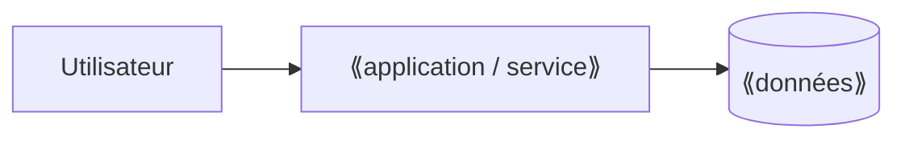

# C6 — Dossier de solution

> **Concevoir** · Phase 4 Préparer la mise en place · à rendre pour **J3**

## 1. La solution retenue en une page

⟪À COMPLÉTER : ce qu'elle fait, pour qui, avec quoi⟫

## 2. Maquettes des écrans clés

Liens vers les maquettes (Figma, Penpot, papier photographié, capture d'un outil configuré) — une par récit **Must** au minimum.

| Récit | Écran | Lien / image |
|---|---|---|
| US-01 | | |

## 3. Architecture

- Hébergement : ⟪où, qui paie, quelle localisation des données⟫
- Comptes et droits : ⟪qui a accès à quoi (→ S3)⟫
- Interfaces avec l'existant : ⟪import, export, outils déjà en place⟫

## 4. Décisions structurantes (ADR)

Une fiche par décision qui serait coûteuse à changer plus tard.

### ADR-01 — ⟪titre⟫
- **Contexte** : ⟪…⟫
- **Options envisagées** : ⟪…⟫
- **Décision** : ⟪…⟫
- **Conséquences** (positives et négatives) : ⟪…⟫

## 5. Reprise des données existantes

| Source actuelle | Volume | Qualité | Méthode de reprise |
|---|---|---|---|
| ⟪ex. tableur partagé⟫ | | | |

---
**Critères de qualité** — [ ] chaque Must a son écran · [ ] au moins 2 ADR · [ ] hébergement et localisation des données précisés · [ ] reprise de l'existant traitée
**Usage de l'IA** : ⟪À COMPLÉTER⟫
