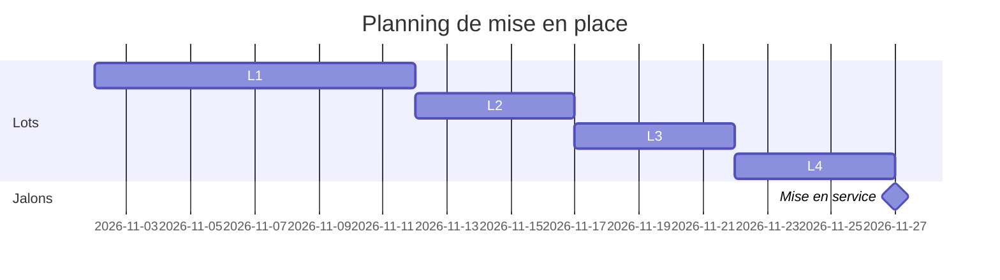

# P1 — Plan de projet

> **Piloter** · Phase 4 · à rendre pour **J3**
>
> 📖 Comment faire : [Étape 17](../guide/E17-plan-projet-raci.md) · 🧩 Exemple rédigé : [P1](../exemples/hbc-val-de-furan/P1-plan-projet.md) · 📂 S'appuie sur : C6, C5 (coûts), P2, échéance du client

## 1. Objectif et échéance

⟪À COMPLÉTER : objectif du projet en une phrase, date de mise en service visée, contrainte de date du client⟫

## 2. Découpage en lots

| Lot | Contenu | Livrable | Charge estimée (j·h) | Prérequis |
|---|---|---|---|---|
| L1 | ⟪ex. configuration / développement du module X⟫ | | | |
| L2 | Reprise des données | | | |
| L3 | Recette | | | |
| L4 | Formation et déploiement | | | |
| | | | **Total** | |

## 3. Jalons et planning

Reportez les jalons dans les **Milestones** GitHub du dépôt.

## 4. RACI

| Activité | ⟪Client-décideur⟫ | ⟪Utilisateur référent⟫ | ⟪Équipe projet⟫ | ⟪Prestataire⟫ |
|---|---|---|---|---|
| Valider les besoins | A | C | R | I |
| ⟪À COMPLÉTER⟫ | | | | |

*R = réalise, A = approuve (un seul par ligne), C = consulté, I = informé.*

## 5. Budget

| Poste | Montant | Qui paie |
|---|---|---|
| ⟪repris de C5⟫ | | |

## 6. Gouvernance

- Points d'avancement : ⟪fréquence, participants, support⟫
- Qui arbitre un désaccord sur le périmètre : ⟪…⟫

---
**Critères de qualité** — [ ] charges chiffrées · [ ] un seul A par ligne du RACI · [ ] jalons présents dans GitHub · [ ] budget cohérent avec C5
**Usage de l'IA** : ⟪À COMPLÉTER⟫
